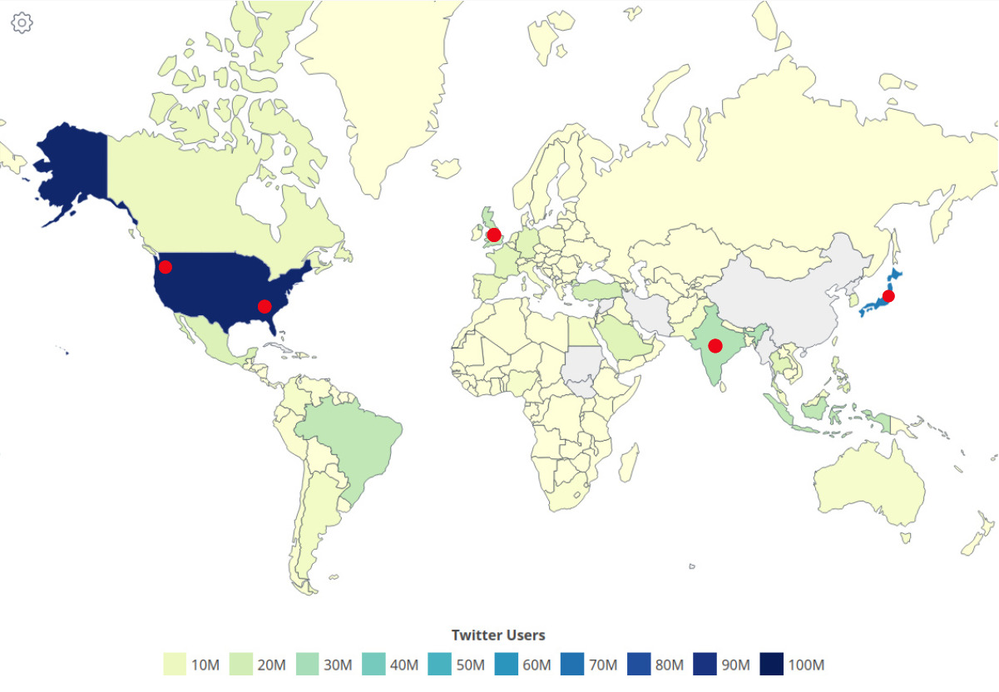
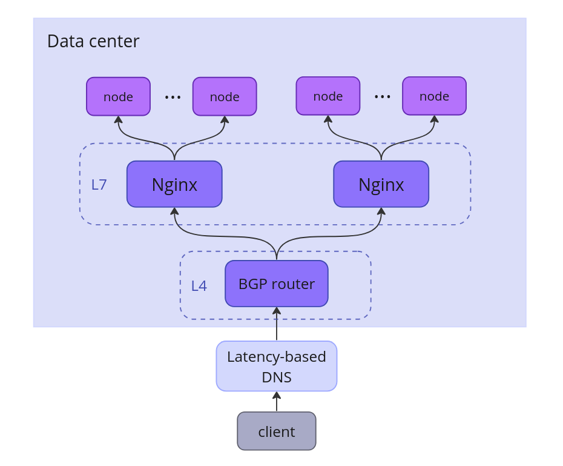
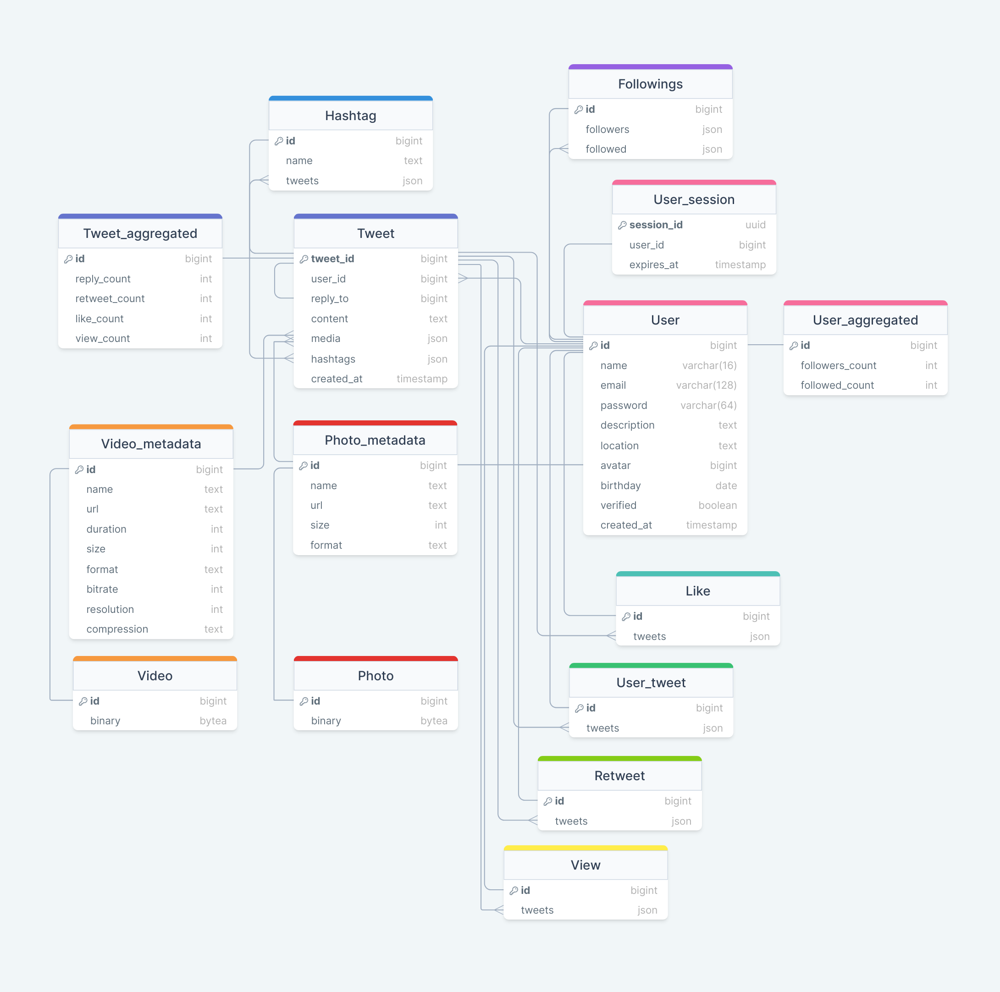
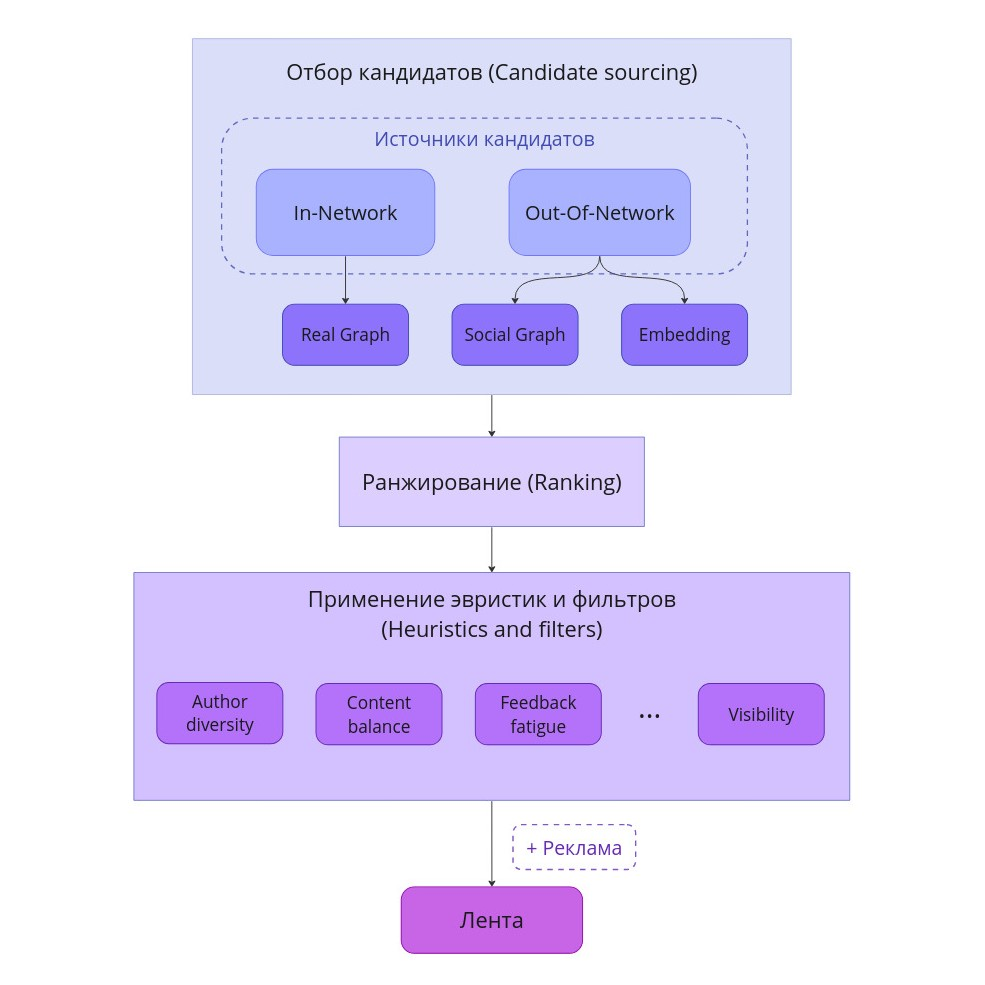

# Highload Twitter

## 1. Тема и целевая аудитория
Твиттер - сервис микроблогов и социальная сеть, в которой пользователи публикуют сообщения, известные как твиты.

### Целевая аудитория

Целевая аудитория Твиттера включает миллионы пользователей по всему миру.  

Топ-10 стран по месячной аудитории (MAU)  
_Данные основаны на показателях рекламных охватов Твиттера, опубликованных в апреле 2023 года._ [[1]](https://datareportal.com/essential-twitter-stats)

| Страна            | Пользователи |
|:------------------|:-------------|
| США               | 64.9 млн     |
| Япония            | 51.8 млн     |
| Бразилия          | 16.6 млн     |
| Великобритания    | 16.1 млн     |
| Индия             | 15.0 млн     |
| Индонезия         | 14.8 млн     |
| Турция            | 13.8 млн     |
| Мексика           | 11.8 млн     |
| Саудовская Аравия | 11.4 млн     |
| Франция           | 9.5 млн      |

### Ключевой функционал
- Регистрация и авторизация
- Публикация твитов
  - Твит может содержать текст до 280 символов (включая хештеги), фото и видео
  - Твит может быть либо отдельным твитом, либо ответом на другой твит
- Возможность лайкать и репостить твиты
- Поиск:
  - пользователей по юзернейму
  - твитов по хештегам
- Подписка на других пользователей
- Получение ленты
  - Лента формируется на основе подписок, активности пользователя, а также рекламы
  - Лента пополняется новыми твитами в реальном времени

## 2. Расчет нагрузки

### Продуктовые метрики

Все найденные метрики, которые будут использоваться в расчетах:
- Количество зарегистрированных пользователей: 1.3 млрд [[2]](https://www.demandsage.com/twitter-statistics/)
- Месячная аудитория (MAU): 528.3 млн [[2]](https://www.demandsage.com/twitter-statistics/)
- Дневная аудитория (DAU): 237.8 млн [[2]](https://www.demandsage.com/twitter-statistics/)
- Среднее время на сайте: 30.9 минут в день [[2]](https://www.demandsage.com/twitter-statistics/)
- 100 самых популярных аккаунтов имеют более 24 миллионов подписчиков [[3]](https://notcommon.com/most-followed/twitter)
- Количество твитов в день: 500 млн [[4]](https://blog.twitter.com/engineering/en_us/a/2013/new-tweets-per-second-record-and-how)

**_Основные метрики_**

| Метрика | Значение  |
|:--------|:----------|
| MAU     | 528.3 млн |
| DAU     | 237.8 млн |

**_Действия пользователя_**

1. Будем считать, что пользователю необходимо проходить авторизацию один раз в 10 дней.
2. Каждый пользователь в среднем получает ленту 5 раз в день. 
3. Пользователь проводит в Твиттере около 30 минут в день.
Будем считать, что за минуту он просматривает 10 твитов. Получаем 300 просмотров в день. 
4. Допустим, что пользователь лайкает пятую часть просмотренных твитов. 
5. Дневная аудитория составляет 237.8 млн пользователей, которые публикуют 500 млн твитов.
Получается, что один пользователь в среднем публикует 2 твита в день. 
6. Предположим, что пользователь подписывается на кого-то в среднем один раз в день.
7. Поиск используется относительно редко, большую часть времени пользователи просматривают твиты из своей ленты.
Поэтому будем считать, что этот функционал используется примерно 3 раза в неделю.

|   | Действие           | Кол-во в день |
|---|:-------------------|:--------------|
| 1 | Авторизация        | 0.1           |
| 2 | Получение ленты    | 5             |
| 3 | Просмотр твита     | 300           |
| 4 | Лайк твита         | 60            |
| 5 | Публикация твита   | 2             |
| 6 | Подписка           | 1             |
| 7 | Поиск по юзернейму | 0.4           |
| 8 | Поиск по хештегу   | 0.4           |

**_Размер хранилища_**

Твит может содержать текст, изображения и видео. Примерный размер этих данных:
1. Текст = ~200 байт [[5]](https://www.slideshare.net/raffikrikorian/twitter-by-the-numbers)
2. Изображение = ~1.2 Мб [[6]](https://gitnux.org/average-photo-size/)
3. Видео = ~40 Мб  
(такой размер имеет 20-секундное видео, снятое на айфон с разрешением 1080p HD и 30 fps
[[7]](https://www.lifewire.com/how-much-video-can-iphone-record-2000304))

Преобладающее большинство твитов содержат одну картинку или одно видео.
Однако твиты, публикующиеся в качестве комментариев, чаще всего не имеют вложений.
Будем считать, что:
- 100% твитов содержат текст
- 40% твитов помимо текста содержат одну картинку
- 3% твитов помимо текста содержат одно видео

С учетом того, что пользователь публикует 2 твита в день,
рассчитаем количество данных для одного пользователя и для всех пользователей за год.

_Для одного пользователя:_
```
1. Текст: 2 * 365 = 730
2. Изображения: 730 * 0.4 = 292
3. Видео: 730 * 0.03 = 22
```

_Для всех пользователей:_
```
1. Текст: 730 * 237.8 млн = ~174 млрд
2. Изображения: 292 * 237.8 млн = ~69 млрд
3. Видео: 22 * 237.8 млн = ~5 млрд
```

_**Размер хранилища пользователя**_

| Тип данных  | Размер 1 шт | Кол-во за год | Размер за год | Кол-во за 5 лет | Размер за 5 лет |
|:------------|-------------|:--------------|:--------------|:----------------|-----------------|
| Текст       | 0.0002 Мб   | 730           | 0.146 Мб      | 3650            | 0.0007 Гб       |
| Изображение | 1.2 Мб      | 292           | 350 Мб        | 1460            | 1.75 Гб         |
| Видео       | 40 Мб       | 22            | 880 Мб        | 110             | 4.4 Гб          |
| `Всего`     |             |               | `~1.2 Гб`     |                 | `~6 Гб`         |

_**Размер хранилища всех пользователей**_

| Тип данных  | Размер 1 шт | Кол-во за год | Размер за год | Кол-во за 5 лет | Размер за 5 лет |
|:------------|-------------|:--------------|:--------------|:----------------|-----------------|
| Текст       | 0.0002 Мб   | 174 млрд      | 0.035 Пб      | 870 млрд        | 0.17 Пб         |
| Изображение | 1.2 Мб      | 69 млрд       | 83 Пб         | 345 млрд        | 415 Пб          |
| Видео       | 40 Мб       | 5 млрд        | 200 Пб        | 25 млрд         | 1000 Пб         |
| `Всего`     |             |               | `~283 Пб`     |                 | `~1415 Пб`      |

### Технические метрики

_**RPS по основным типам запросов**_

_Регистрация_

Твиттер стал доступен для пользователей в середине 2006 года.
На начало 2024 года количество зарегистрированных пользователей составляет 1.3 млрд.

```
1.3 млрд регистраций / 17.5 лет = ~74 млн регистраций/год
RPS = (74 млн регистраций/год) / (365 * 24 * 60 * 60) = ~2.3
```

_Авторизация_
```
237.8 млн польз. * 0.1 авторизаций/день = 23.78 млн авторизаций/день
RPS = (23.78 млн авторизаций/день) / (24 * 60 * 60) = ~275
```

_Получение ленты_
```
237.8 млн польз. * 5 получений ленты/день = 1.19 млрд получений ленты/день
RPS = (1.19 млрд получений ленты/день) / (24 * 60 * 60) = ~13 770
```

_Просмотр твита_  
```
237.8 млн польз. * 300 просмотров/день = 71.34 млрд просмотров/день
RPS = (71.34 млрд просмотров/день) / (24 * 60 * 60) = ~825 700
```

_Лайк твита_
```
237.8 млн польз. * 60 лайков/день = 14.3 млрд лайков/день
RPS = (14.3 млрд лайков/день) / (24 * 60 * 60) = ~165 140
```

_Публикация твита_
```
RPS = (500 млн твитов/день) / (24 * 60 * 60) = ~5790
```

_Подписка_
```
237.8 млн польз. * 1 подписка/день = 237.8 млн подписок/день
RPS = (237.8 млн подписок/день) / (24 * 60 * 60) = ~2750
```

_Поиск по юзернейму_
```
237.8 млн польз. * 0.4 поисков/день = 95 млн поисков/день
RPS = (95 млн поисков/день) / (24 * 60 * 60) = ~1100
```

_Поиск по хештегу_
```
237.8 млн польз. * 0.4 поисков/день = 95 млн поисков/день
RPS = (95 млн поисков/день) / (24 * 60 * 60) = ~1100
```

Самый загруженный час в Твиттере - с 12:00 до 13:00 (США), за это время отправляется 5.44 % всех твитов. [[8]](https://smallbusiness.chron.com/peak-times-twitter-activity-62864.html)  
Будем считать, что пиковая нагрузка в 1.3 раза выше средней.

| Действие           | RPS     | Пиковое значение RPS |
|:-------------------|:--------|----------------------|
| Регистрация        | 2.3     | 3                    |
| Авторизация        | 275     | 358                  |
| Получение ленты    | 13 770  | 17 900               |
| Просмотр твита     | 825 700 | 1 073 400            |
| Лайк твита         | 165 140 | 214 700              |
| Публикация твита   | 5790    | 7527                 |
| Подписка           | 2750    | 3575                 |
| Поиск по юзернейму | 1100    | 1430                 |
| Поиск по хештегу   | 1100    | 1430                 |

_**Сетевой трафик**_

Допустим, средний размер твита 0.5 Мб.  
Рассчитаем пиковое потребление сетевого трафика в течение суток.
```
Просмотр: 1 073 400 твитов/c * 0.5 Мб = 536.7 Гб/c
Публикация: 7527 твитов/c * 0.5 Мб = 3.8 Гб/c
```


## 3. Глобальная балансировка нагрузки

### Расположение датацентров

На карте отражено распределение месячной аудитории Твиттера по странам. [[9]](https://worldpopulationreview.com/country-rankings/twitter-users-by-country)


Месячная аудитория Твиттера составляет примерно 528.3 млн пользователей со всех континентов.

Известно, что в США есть два датацентра - в Портленде и Атланте.
Они обрабатывают запросы пользователей Северной и Южной Америки, количество которых составляет около 40% от всей аудитории.

Также большое количество пользователей находится в Японии, поэтому там будет расположен еще один датацентр.
На него будут приходить запросы из Восточной и Юго-Восточной Азии, а также Австралии.

Необходим еще один датацентр для Европы и Африки. Так как наибольшее количество пользователей находится в Великобритании 
и близлежащих странах, расположим датацентр в Великобритании.  

И последний датацентр будет располагаться в Индии и обслуживать запросы располагающихся рядом стран.

- 2 датацентра в США - ~40% всех запросов
- 1 датацентр в Японии - ~20% всех запросов
- 1 датацентр в Великобритании - ~20% всех запросов
- 1 датацентр в Индии - 20% всех запросов

Значение RPS по всем основным запросам составляет:  
```RPS = 825 700 + 165 140 + 5790 + 2750 + 1100 + 1100 = ~ 1 млн```  

Получается, что каждый датацентр будет иметь нагрузку около 200 000 RPS.

| Датацентр        | Зона                                      |
|:-----------------|:------------------------------------------|
| США, Портленд    | Западные штаты США и Канада               |
| США, Атланта     | Восточные штаты США, Южная Америка        |
| Япония           | Восточная и Юго-Восточная Азия, Австралия |
| Великобритания   | Европа, Африка                            |
| Индия            | Южная, Юго-Западная и Центральная Азия    |

### Глобальная балансировка

Для глобальной балансировки будет использоваться latency-based DNS.  
Это позволит отправлять запросы пользователя в ближайшие датацентры, которые отвечают с минимальной задержкой.

## 4. Локальная балансировка нагрузки

### Схема балансировки



С помощью Latency-based DNS пользователь получает адрес нужного датацентра.  

На входе в датацентр стоит маршрутизатор, который равномерно распределяет трафик между
несколькими Nginx балансировщиками по алгоритму хэширования. Если один из балансировщиков упадет,
то весь трафик перераспределится на другие.  
Nginx осуществляет балансировку на ноды Kubernetes.  
Kubernetes выполняет auto-scaling, перезапускает сервисы при падении. Это обеспечивает отказоустойчивость.

## 5. Логическая схема БД



### Размер данных

- int = 4 байта
- bigint = 8 байт
- uuid = 16 байт
- date = 4 байта
- timestamp = 8 байт
- boolean = 1 байт
- varchar(n) = n байт
- текст твита = ~200 байт
- название медиафайла = ~16 байт
- url медиафайла = ~64 байта

Во втором разделе было определено, что за год пользователи публикуют
~174 млрд твитов, ~69 млрд изображений и ~5 млрд видео.  
В таблице представлено примерное количество записей, созданных за 17.5 лет, и примерный размер.


| Таблица          | Размер одной записи | Кол-во записей | Размер всех записей |
|:-----------------|---------------------|----------------|---------------------|
| User             | ~430 байт           | 1.3 млрд       | 560 Гб              |
| User_aggregated  | ~16 байт            | 1.3 млрд       | 21 Гб               |
| User_session     | ~32 байта           | 237.8 млн      | 8 Гб                |
| Tweet            | ~250 байт           | 3000 млрд      | 750 Тб              |
| Tweet_aggregated | ~24 байта           | 3000 млрд      | 72 Тб               |
| Photo_metadata   | ~100 байт           | 1200 млрд      | 120 Тб              |
| Video_metadata   | ~120 байт           | 90 млрд        | 11 Тб               |

## 6. Физическая схема БД

### Выбор СУБД

|    | Таблица          | СУБД       |
|:---|:-----------------|------------|
| 1  | User             | Cassandra  |
| 2  | User_aggregated  | ClickHouse |
| 3  | User_session     | Redis      |
| 4  | Followings       | FlockDB    |
| 5  | Like             | Aerospike  |
| 6  | User_tweet       | Aerospike  |
| 7  | Retweet          | Aerospike  |
| 8  | View             | Aerospike  |
| 9  | Tweet            | Cassandra  |
| 10 | Tweet_aggregated | ClickHouse |
| 11 | Hashtag          | Cassandra  |
| 12 | Photo_metadata   | Cassandra  |
| 13 | Video_metadata   | Cassandra  |
| 14 | Photo            | S3         |
| 15 | Video            | S3         |


### Шардирование и репликация

Ниже перечислены таблицы, которые будут шардироваться. Репликация будет настроена для всех шардов.  
В качестве коэффициента репликации (Replication Factor, RF) выбраны значения,
рекомендуемые в документации используемых СУБД.   

|    | Таблица          | Поле       | СУБД       | RF | Тип репликации | 
|----|:-----------------|------------|------------|----|----------------|
| 1  | User             | id         | Cassandra  | 3  | Masterless     |
| 2  | User_aggregated  | id         | ClickHouse | 3  | Multi-Master   |
| 3  | User_session     | session_id | Redis      | 2  | Master - Slave |
| 4  | Like             | id         | Aerospike  | 2  | Master - Slave |
| 5  | User_tweet       | id         | Aerospike  | 2  | Master - Slave |
| 6  | Retweet          | id         | Aerospike  | 2  | Master - Slave |
| 7  | View             | id         | Aerospike  | 2  | Master - Slave |
| 8  | Tweet            | tweet_id   | Cassandra  | 3  | Masterless     |
| 9  | Tweet_aggregated | tweet_id   | ClickHouse | 3  | Multi-Master   |
| 10 | Photo_metadata   | id         | Cassandra  | 3  | Masterless     |
| 11 | Video_metadata   | id         | Cassandra  | 3  | Masterless     |

### Индексы

В Кассандре можно создать вторичный индекс, но он создается отдельно для данных на каждой ноде.  
Если создать вторичный индекс, например, по имени пользователя, то при выполнении поиска придется считывать индекс с множества нод.

Эффективнее использовать дополнительные инструменты. Поэтому для таблиц User и Hashtag будут созданы индексы в Elasticsearch.

| Таблица | Поле | Индекс              |
|:--------|------|---------------------|
| User    | name | Elasticsearch index |
| Hashtag | name | Elasticsearch index |


## 7. Алгоритмы

### Twitter's Recommendation Algorithm

В 2023 году компания Твиттер сделала общедоступным исходный код своего алгоритма рекомендаций.
[[10]](https://github.com/twitter/the-algorithm)
Рассмотрим, как работает алгоритм для выполнения одного запроса на получение ленты.  

**1. Отбор кандидатов**

Есть два типа кандидатов:
- Твиты от пользователей, на которых вы подписаны - In‑Network
- Твиты от пользователей, на которых вы не подписаны - Out‑of‑Network

_**In-Network**_  
Твиты In-Network ранжируются с помощью модели Real Graph.  
Эта модель предсказывает вероятность взаимодействия между двумя пользователями.
Чем выше эта вероятность между вами и другим пользователем,
тем больше в ленту будут включаться его твиты.

_**Out‑of‑Network**_  
Для выборки твитов Out‑of‑Network есть два подхода:
- **Social Graph**  
Этот подход анализирует действия пользователя и граф подписок, чтобы выбрать твиты на основе следующих вопросов:
  - ```Какие твиты недавно лайкнули люди, на которых я подписан?``` 
  - ```Кто лайкает те же твиты, что и я? Что еще они недавно лайкнули?```


- **Embedding Spaces**  
Этот подход выбирает твиты на основе вопроса:
  - ```Какие твиты и пользователи похожи на мои интересы?```  

Сходство между двумя твитами и пользователями определяется с помощью эмбеддингов.
Эмбеддинг - это численное представление интересов пользователей и содержимого твитов.


В результате этапа отбора кандидатов из миллионов твитов извлекается около 1500 самых актуальных.

**2. Ранжирование**

На этом этапе нейронная сеть определяет, насколько каждый твит соответствует ленте пользователя.  
В результате ранжирования все твиты получают оценку, состоящую из 10 меток.
Каждая метка показывает вероятность взаимодействия с этим твитом.

**3. Применение эвристик и фильтров**

На этом этапе к твитам применяются эвристики и фильтры. Несколько примеров:
- **Разнообразие авторов (Author diversity)** - избегание длинных последовательностей твитов одного автора
- **Баланс контента (Content balance)** - обеспечение баланса In-Network и Out-of-Network твитов,
их должно быть примерно поровну
- **Учет негативного фидбека (Feedback fatigue)** - снижение оценки твитов, похожих на те,
где пользователь дал отрицательную обратную связь
- **Фильтрация по видимости (Visibility)** - фильтрация твитов от заблокированных аккаунтов,
а также твитов с неприличным содержанием



## Источники
1. https://datareportal.com/essential-twitter-stats
2. https://www.demandsage.com/twitter-statistics/
3. https://notcommon.com/most-followed/twitter
4. https://blog.twitter.com/engineering/en_us/a/2013/new-tweets-per-second-record-and-how
5. https://www.slideshare.net/raffikrikorian/twitter-by-the-numbers
6. https://gitnux.org/average-photo-size/
7. https://www.lifewire.com/how-much-video-can-iphone-record-2000304
8. https://smallbusiness.chron.com/peak-times-twitter-activity-62864.html
9. https://worldpopulationreview.com/country-rankings/twitter-users-by-country
10. https://github.com/twitter/the-algorithm
