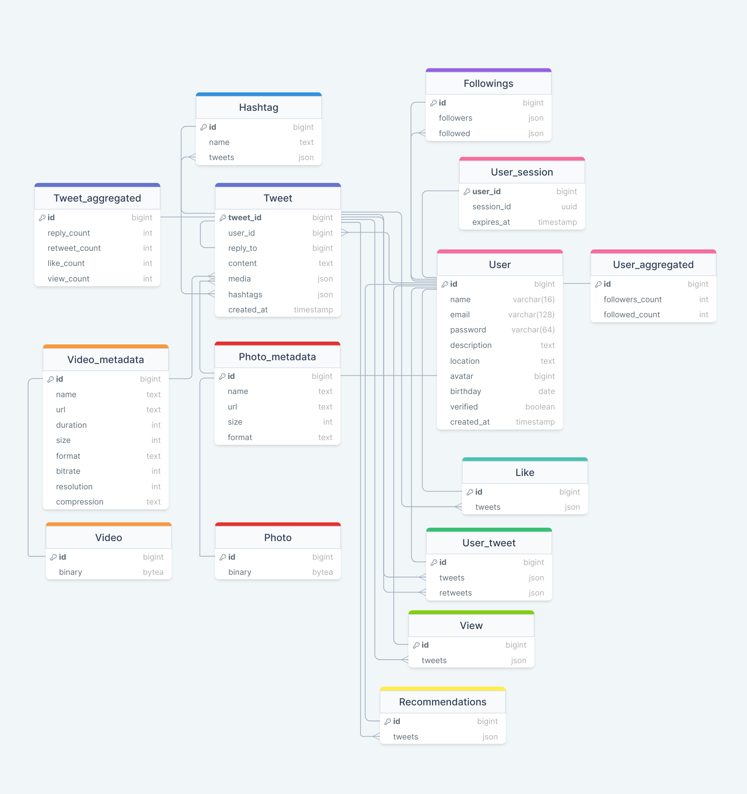

# Highload Twitter

## 1. Тема и целевая аудитория
Твиттер - сервис микроблогов и социальная сеть, в которой пользователи публикуют сообщения, известные как твиты.

### Целевая аудитория

Целевая аудитория Твиттера включает миллионы пользователей по всему миру.  

Топ-10 стран по месячной аудитории (MAU)  
_Данные основаны на показателях рекламных охватов Твиттера, опубликованных в апреле 2023 года._ [[1]](https://datareportal.com/essential-twitter-stats)

| Страна            | Пользователи |
|:------------------|:-------------|
| США               | 64.9 млн     |
| Япония            | 51.8 млн     |
| Бразилия          | 16.6 млн     |
| Великобритания    | 16.1 млн     |
| Индия             | 15.0 млн     |
| Индонезия         | 14.8 млн     |
| Турция            | 13.8 млн     |
| Мексика           | 11.8 млн     |
| Саудовская Аравия | 11.4 млн     |
| Франция           | 9.5 млн      |

### Ключевой функционал
- Регистрация и авторизация
- Публикация твитов
  - Твит может содержать текст до 280 символов (включая хештеги), фото и видео
  - Твит может быть либо отдельным твитом, либо ответом на другой твит
- Возможность лайкать и репостить твиты
- Поиск:
  - пользователей по юзернейму
  - твитов по хештегам
- Подписка на других пользователей
- Получение ленты
  - Лента формируется на основе подписок, активности пользователя, а также рекламы
  - Лента пополняется новыми твитами в реальном времени

## 2. Расчет нагрузки

### Продуктовые метрики

Все найденные метрики, которые будут использоваться в расчетах:
- Количество зарегистрированных пользователей: 1.3 млрд [[2]](https://www.demandsage.com/twitter-statistics/)
- Месячная аудитория (MAU): 528.3 млн [[2]](https://www.demandsage.com/twitter-statistics/)
- Дневная аудитория (DAU): 237.8 млн [[2]](https://www.demandsage.com/twitter-statistics/)
- Среднее время на сайте: 30.9 минут в день [[2]](https://www.demandsage.com/twitter-statistics/)
- 100 самых популярных аккаунтов имеют более 24 миллионов подписчиков [[3]](https://notcommon.com/most-followed/twitter)
- Количество твитов в день: 500 млн [[4]](https://blog.twitter.com/engineering/en_us/a/2013/new-tweets-per-second-record-and-how)

**_Основные метрики_**

| Метрика | Значение  |
|:--------|:----------|
| MAU     | 528.3 млн |
| DAU     | 237.8 млн |

**_Действия пользователя_**

Согласно статистике дневная аудитория Твиттера составляет 237.8 млн пользователей,
которые публикуют около 500 млн твитов. Получается, что один пользователь в среднем публикует 2 твита в день.  

Известно, что пользователь проводит в Твиттере около 30 минут в день.
Учитывая, что среди твитов попадаются видео, будем считать, что за одну минуту пользователь успевает просмотреть
около 10 твитов. Получаем 300 твитов в день.  
Также будем считать, что из всех просмотренных твитов, пользователь лайкает только пятую часть.

Поиск используется относительно редко, большую часть времени пользователи просматривают твиты из своей ленты.
Поэтому будем считать, что этот функционал используется примерно 3 раза в неделю.

| Действие           | Кол-во в день |
|:-------------------|:--------------|
| Просмотр твита     | 300           |
| Лайк твита         | 60            |
| Публикация твита   | 2             |
| Подписка           | 1             |
| Поиск по юзернейму | 0.4           |
| Поиск по хештегу   | 0.4           |

**_Размер хранилища_**

Твит может содержать текст, изображения и видео. Примерный размер этих данных:
- Текст = ~200 байт [[5]](https://www.slideshare.net/raffikrikorian/twitter-by-the-numbers)
- Изображение = ~1.2 Мб [[6]](https://gitnux.org/average-photo-size/)
- Видео = ~40 Мб  
(такой размер имеет 20-секундное видео, снятое на айфон с разрешением 1080p HD и 30 fps
[[7]](https://www.lifewire.com/how-much-video-can-iphone-record-2000304))

Преобладающее большинство твитов содержат одну картинку или одно видео.
Однако твиты, публикующиеся в качестве комментариев, чаще всего не имеют вложений.
Будем считать, что:
- 100% твитов содержат текст
- 40% твитов содержат одну картинку и текст
- 3% твитов содержат одно видео и текст

Пользователь в среднем публикует 2 твита в день, в год получаем:
- текстовые твиты: 2 * 365 = 730
- изображения: 730 * 0.4 = 292
- видео: 730 * 0.03 = 22

_**Размер хранилища пользователя**_

| Тип данных  | Размер 1 шт | Кол-во за год | Размер за год | Кол-во за 5 лет | Размер за 5 лет |
|:------------|-------------|:--------------|:--------------|:----------------|-----------------|
| Текст       | 0.0002 Мб   | 730           | 0.146 Мб      | 3650            | 0.0007 Гб       |
| Изображение | 1.2 Мб      | 292           | 350 Мб        | 1460            | 1.75 Гб         |
| Видео       | 40 Мб       | 22            | 880 Мб        | 110             | 4.4 Гб          |
| `Всего`     |             |               | `~1.2 Гб`     |                 | `~6 Гб`         |

Также рассчитаем размер хранилища для всех твитов, опубликованных за год.
В день публикуется 500 млн твитов, поэтому в год получим:
- текстовые твиты: 500 млн * 365 = 182.5 млрд
- изображения: 182.5 млрд * 0.4 = 73 млрд
- видео: 182.5 млрд * 0.03 = 5.475 млрд


| Тип данных  | Размер 1 шт | Кол-во     | Размер  | 
|:------------|-------------|:-----------|:--------|
| Текст       | 0.0002 Мб   | 182.5 млрд | 36.5 Тб |
| Изображение | 1.2 Мб      | 73 млрд    | 87.6 Пб |
| Видео       | 40 Мб       | 5.475 млрд | 219 Пб  |


### Технические метрики

_**RPS по основным типам запросов**_

_Просмотр твита_  
```
237.8 млн польз. * 300 просмотров/день = 71.34 млрд просмотров/день
RPS = (71.34 млрд просмотров/день) / (24 * 60 * 60) = ~825 700
```

_Лайк твита_
```
237.8 млн польз. * 60 лайков/день = 14.3 млрд лайков/день
RPS = (14.3 млрд лайков/день) / (24 * 60 * 60) = ~165 140
```

_Публикация твита_
```
RPS = (500 млн твитов/день) / (24 * 60 * 60) = ~5790
```

_Подписка_
```
237.8 млн польз. * 1 подписка/день = 237.8 млн подписок/день
RPS = (237.8 млн подписок/день) / (24 * 60 * 60) = ~2750
```

_Поиск по юзернейму_
```
237.8 млн польз. * 0.4 поисков/день = 95 млн поисков/день
RPS = (95 млн поисков/день) / (24 * 60 * 60) = ~1100
```

_Поиск по хештегу_
```
237.8 млн польз. * 0.4 поисков/день = 95 млн поисков/день
RPS = (95 млн поисков/день) / (24 * 60 * 60) = ~1100
```

Самый загруженный час в Твиттере - с 12:00 до 13:00 (США), за это время отправляется 5.44 % всех твитов. [[8]](https://smallbusiness.chron.com/peak-times-twitter-activity-62864.html)  
Будем считать, что пиковая нагрузка в 1.3 раза выше средней.

| Действие           | RPS     | Пиковое значение RPS |
|:-------------------|:--------|----------------------|
| Просмотр твита     | 825 700 | 1 073 400            |
| Лайк твита         | 165 140 | 214 700              |
| Публикация твита   | 5790    | 7527                 |
| Подписка           | 2750    | 3575                 |
| Поиск по юзернейму | 1100    | 1430                 |
| Поиск по хештегу   | 1100    | 1430                 |

_**Сетевой трафик**_

Допустим, средний размер твита 0.5 Мб.  
Рассчитаем пиковое потребление сетевого трафика в течение суток.
```
Просмотр: 1 073 400 твитов/c * 0.5 Мб = 536.7 Гб/c
Публикация: 7527 твитов/c * 0.5 Мб = 3.8 Гб/c
```


## 3. Глобальная балансировка нагрузки

### Расположение датацентров

На карте отражено распределение месячной аудитории Твиттера по странам. [[9]](https://worldpopulationreview.com/country-rankings/twitter-users-by-country)


Месячная аудитория Твиттера составляет примерно 528.3 млн пользователей со всех континентов.

Известно, что в США есть два датацентра - в Портленде и Атланте.
Они обрабатывают запросы пользователей Северной и Южной Америки, количество которых составляет около 40% от всей аудитории.

Также большое количество пользователей находится в Японии, поэтому там будет расположен еще один датацентр.
На него будут приходить запросы из Восточной и Юго-Восточной Азии, а также Австралии.

Необходим еще один датацентр для Европы и Африки. Так как наибольшее количество пользователей находится в Великобритании 
и близлежащих странах, расположим датацентр в Великобритании.  

И последний датацентр будет располагаться в Индии и обслуживать запросы располагающихся рядом стран.

- 2 датацентра в США - ~40% всех запросов
- 1 датацентр в Японии - ~20% всех запросов
- 1 датацентр в Великобритании - ~20% всех запросов
- 1 датацентр в Индии - 20% всех запросов

Значение RPS по всем основным запросам составляет:  
```RPS = 825 700 + 165 140 + 5790 + 2750 + 1100 + 1100 = ~ 1 млн```  

Получается, что каждый датацентр будет иметь нагрузку около 200 000 RPS.

| Датацентр        | Зона                                      |
|:-----------------|:------------------------------------------|
| США, Портленд    | Западные штаты США и Канада               |
| США, Атланта     | Восточные штаты США, Южная Америка        |
| Япония           | Восточная и Юго-Восточная Азия, Австралия |
| Великобритания   | Европа, Африка                            |
| Индия            | Южная, Юго-Западная и Центральная Азия    |

### Глобальная балансировка

Для глобальной балансировки будет использоваться latency-based DNS.  
Это позволит отправлять запросы пользователя в ближайшие датацентры, которые отвечают с минимальной задержкой.

## 4. Локальная балансировка нагрузки

### Схема балансировки


С помощью Latency-based DNS пользователь получает адрес нужного датацентра.  

На входе в датацентр стоит маршрутизатор, который равномерно распределяет трафик между
несколькими Nginx балансировщиками по алгоритму хэширования. Если один из балансировщиков упадет,
то весь трафик перераспределится на другие.  
Nginx осуществляет балансировку на ноды Kubernetes.  
Kubernetes выполняет auto-scaling, перезапускает сервисы при падении. Это обеспечивает отказоустойчивость.

## 5. Логическая схема БД



### Размер данных

- int = 4 байта
- bigint = 8 байт
- uuid = 16 байт
- date = 4 байта
- timestamp = 8 байт
- varchar(n) = n байт
- текст твита = ~200 байт
- название тега = ~20 байт

## 5. Физическая схема БД

### Выбор СУБД

|    | Таблица          | СУБД      |
|:---|:-----------------|-----------|
| 1  | User             | Cassandra |
| 2  | User_aggregated  | Cassandra |
| 3  | User_session     | Redis     |
| 4  | Followings       | FlockDB   |
| 5  | Like             | HDFS      |
| 6  | User_tweet       | HDFS      |
| 7  | View             | HDFS      |
| 8  | Recommendations  | Aerospike |
| 9  | Tweet            | Cassandra |
| 10 | Tweet_aggregated | Cassandra |
| 11 | Hashtag          | Cassandra |
| 12 | Photo_metadata   | Cassandra |
| 13 | Video_metadata   | Cassandra |
| 14 | Photo            | S3        |
| 15 | Video            | S3        |


### Шардирование
- User
- User_aggregated
- User_session
- Like
- User_tweet
- View
- Recommendations
- Tweet
- Tweet_aggregated
- Photo_metadata
- Video_metadata
- Hashtag

### Репликация

Каждый шард будет реплицироваться по типу Master-Slave.

### Индексы

- User: hash по id, b-tree по name
- User_aggregated: hash по id
- Tweet: hash по id
- Tweet_aggregated: hash по id
- Hashtag: hash по id, b-tree по name
- Photo_metadata: hash по id
- Video_metadata: hash по id


## Источники
1. https://datareportal.com/essential-twitter-stats
2. https://www.demandsage.com/twitter-statistics/
3. https://notcommon.com/most-followed/twitter
4. https://blog.twitter.com/engineering/en_us/a/2013/new-tweets-per-second-record-and-how
5. https://www.slideshare.net/raffikrikorian/twitter-by-the-numbers
6. https://gitnux.org/average-photo-size/
7. https://www.lifewire.com/how-much-video-can-iphone-record-2000304
8. https://smallbusiness.chron.com/peak-times-twitter-activity-62864.html
9. https://worldpopulationreview.com/country-rankings/twitter-users-by-country
