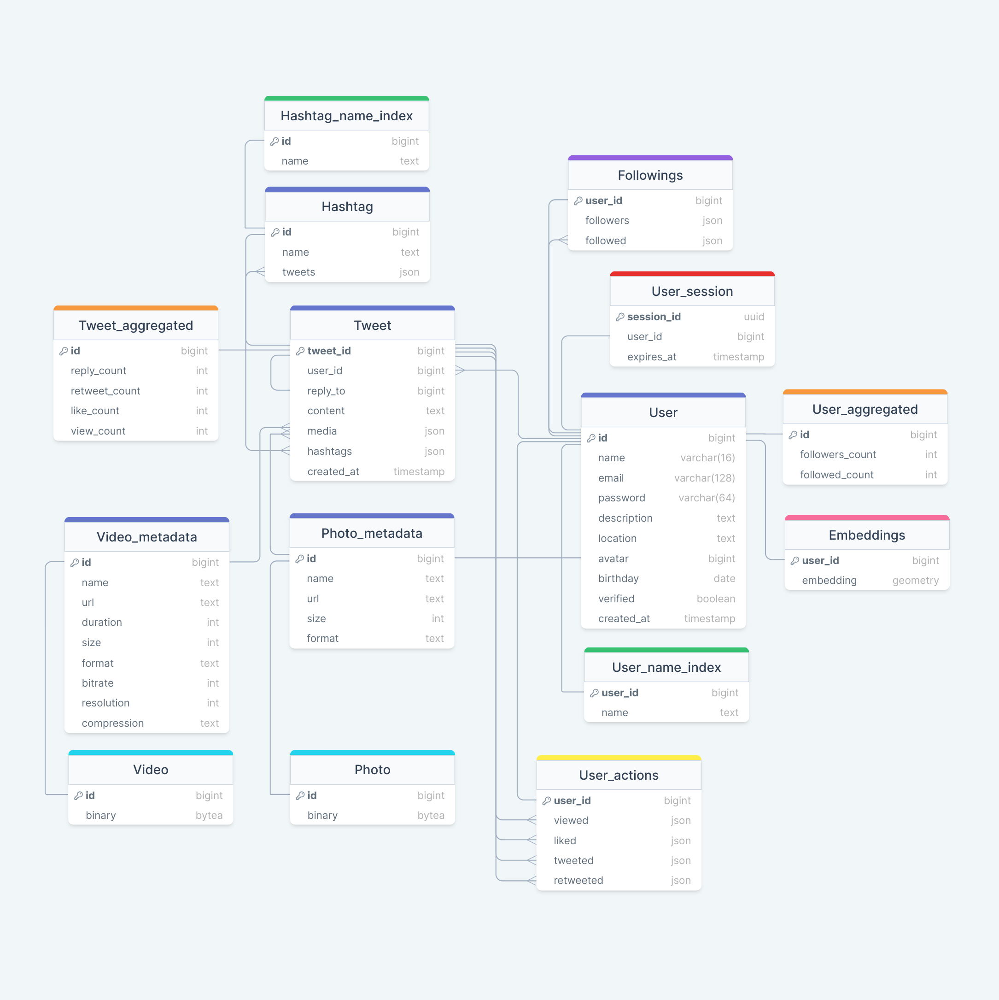
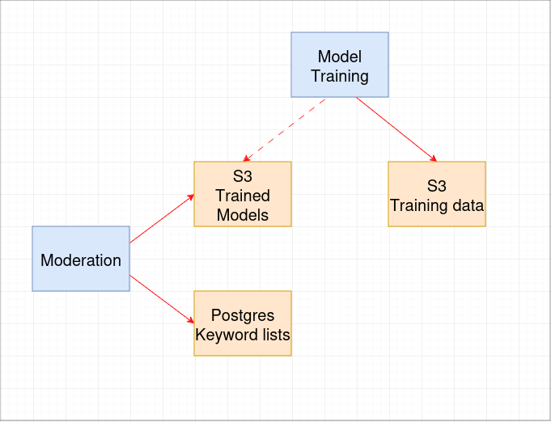

# Highload Twitter

## Разделы
1. [Тема и целевая аудитория](#1-тема-и-целевая-аудитория)
2. [Расчет нагрузки](#2-расчет-нагрузки)
3. [Глобальная балансировка нагрузки](#3-глобальная-балансировка-нагрузки)
4. [Локальная балансировка нагрузки](#4-локальная-балансировка-нагрузки)
5. [Логическая схема БД](#5-логическая-схема-бд)
6. [Физическая схема БД](#6-физическая-схема-бд)
7. [Алгоритмы](#7-алгоритмы)
8. [Технологии](#8-технологии)
9. [Схема проекта](#9-схема-проекта)
10. [Обеспечение надежности](#10-обеспечение-надежности)
11. [Расчет ресурсов](#11-расчет-ресурсов)

## 1. Тема и целевая аудитория
Твиттер - сервис микроблогов и социальная сеть, в которой пользователи публикуют сообщения, известные как твиты.

### Целевая аудитория

Целевая аудитория Твиттера включает миллионы пользователей по всему миру.  

Топ-10 стран по месячной аудитории (MAU)  
_Данные основаны на показателях рекламных охватов Твиттера, опубликованных в апреле 2023 года._ [[1]](https://datareportal.com/essential-twitter-stats)

| Страна            | Пользователи |
|:------------------|:-------------|
| США               | 64.9 млн     |
| Япония            | 51.8 млн     |
| Бразилия          | 16.6 млн     |
| Великобритания    | 16.1 млн     |
| Индия             | 15.0 млн     |
| Индонезия         | 14.8 млн     |
| Турция            | 13.8 млн     |
| Мексика           | 11.8 млн     |
| Саудовская Аравия | 11.4 млн     |
| Франция           | 9.5 млн      |

### Ключевой функционал
- Регистрация и авторизация
- Публикация твитов
  - Твит может содержать текст до 280 символов (включая хештеги), фото и видео
  - Твит может быть либо отдельным твитом, либо ответом на другой твит
- Возможность лайкать и репостить твиты
- Поиск:
  - пользователей по юзернейму
  - твитов по хештегам
- Подписка на других пользователей
- Получение ленты
  - Лента формируется на основе подписок, активности пользователя, а также рекламы
  - Лента пополняется новыми твитами в реальном времени

## 2. Расчет нагрузки

### Продуктовые метрики

Все найденные метрики, которые будут использоваться в расчетах:
- Количество зарегистрированных пользователей: 1.3 млрд [[2]](https://www.demandsage.com/twitter-statistics/)
- Месячная аудитория (MAU): 528.3 млн [[2]](https://www.demandsage.com/twitter-statistics/)
- Дневная аудитория (DAU): 237.8 млн [[2]](https://www.demandsage.com/twitter-statistics/)
- Среднее время на сайте: 30.9 минут в день [[2]](https://www.demandsage.com/twitter-statistics/)
- 100 самых популярных аккаунтов имеют более 24 миллионов подписчиков [[3]](https://notcommon.com/most-followed/twitter)
- Количество твитов в день: 500 млн [[4]](https://blog.twitter.com/engineering/en_us/a/2013/new-tweets-per-second-record-and-how)

**_Основные метрики_**

| Метрика | Значение  |
|:--------|:----------|
| MAU     | 528.3 млн |
| DAU     | 237.8 млн |

**_Действия пользователя_**

1. Каждый пользователь в среднем получает ленту 5 раз в день. 
2. Пользователь проводит в Твиттере около 30 минут в день.
Будем считать, что за минуту он просматривает 10 твитов. Получаем 300 просмотров в день. 
3. Допустим, что пользователь лайкает пятую часть просмотренных твитов. 
4. Дневная аудитория составляет 237.8 млн пользователей, которые публикуют 500 млн твитов.
Получается, что один пользователь в среднем публикует 2 твита в день. 
5. Предположим, что пользователь подписывается на кого-то в среднем один раз в день.
6. Поиск используется относительно редко, большую часть времени пользователи просматривают твиты из своей ленты.
Поэтому будем считать, что этот функционал используется примерно 3 раза в неделю.

|   | Действие           | Кол-во в день |
|---|:-------------------|:--------------|
| 1 | Авторизация        | 100           |
| 2 | Получение ленты    | 5             |
| 3 | Просмотр твита     | 300           |
| 4 | Лайк твита         | 60            |
| 5 | Публикация твита   | 2             |
| 6 | Подписка           | 1             |
| 7 | Поиск по юзернейму | 0.4           |
| 8 | Поиск по хештегу   | 0.4           |

**_Размер хранилища_**

Твит может содержать текст, изображения и видео. Примерный размер этих данных:
1. Текст = ~200 байт [[5]](https://www.slideshare.net/raffikrikorian/twitter-by-the-numbers)
2. Изображение = ~1.2 Мб [[6]](https://gitnux.org/average-photo-size/)
3. Видео = ~40 Мб  
(такой размер имеет 20-секундное видео, снятое на айфон с разрешением 1080p HD и 30 fps
[[7]](https://www.lifewire.com/how-much-video-can-iphone-record-2000304))

Преобладающее большинство твитов содержат одну картинку или одно видео.
Однако твиты, публикующиеся в качестве комментариев, чаще всего не имеют вложений.
Будем считать, что:
- 100% твитов содержат текст
- 40% твитов помимо текста содержат одну картинку
- 3% твитов помимо текста содержат одно видео

С учетом того, что пользователь публикует 2 твита в день,
рассчитаем количество данных для одного пользователя и для всех пользователей за год.

_Для одного пользователя:_
```
1. Текст: 2 * 365 = 730
2. Изображения: 730 * 0.4 = 292
3. Видео: 730 * 0.03 = 22
```

_Для всех пользователей:_
```
1. Текст: 730 * 237.8 млн = ~174 млрд
2. Изображения: 292 * 237.8 млн = ~69 млрд
3. Видео: 22 * 237.8 млн = ~5 млрд
```

_**Размер хранилища пользователя**_

| Тип данных  | Размер 1 шт | Кол-во за год | Размер за год | Кол-во за 5 лет | Размер за 5 лет |
|:------------|-------------|:--------------|:--------------|:----------------|-----------------|
| Текст       | 0.0002 Мб   | 730           | 0.146 Мб      | 3 650           | 0.0007 Гб       |
| Изображение | 1.2 Мб      | 292           | 350 Мб        | 1 460           | 1.75 Гб         |
| Видео       | 40 Мб       | 22            | 880 Мб        | 110             | 4.4 Гб          |
| `Всего`     |             |               | `~1.2 Гб`     |                 | `~6 Гб`         |

_**Размер хранилища всех пользователей**_

| Тип данных  | Размер 1 шт | Кол-во за год | Размер за год | Кол-во за 5 лет | Размер за 5 лет |
|:------------|-------------|:--------------|:--------------|:----------------|-----------------|
| Текст       | 0.0002 Мб   | 174 млрд      | 0.035 Пб      | 870 млрд        | 0.17 Пб         |
| Изображение | 1.2 Мб      | 69 млрд       | 83 Пб         | 345 млрд        | 415 Пб          |
| Видео       | 40 Мб       | 5 млрд        | 200 Пб        | 25 млрд         | 1000 Пб         |
| `Всего`     |             |               | `~283 Пб`     |                 | `~1415 Пб`      |

### Технические метрики

#### RPS по основным типам запросов

_Регистрация_

Твиттер стал доступен для пользователей в середине 2006 года.
На начало 2024 года количество зарегистрированных пользователей составляет 1.3 млрд.

```
1.3 млрд регистраций / 17.5 лет = ~74 млн регистраций/год
RPS = (74 млн регистраций/год) / (365 * 24 * 60 * 60) = ~2.3
```

_Авторизация_
```
237.8 млн польз. * 100 авторизаций/день = 23.78 млрд авторизаций/день
RPS = (23.78 млрд авторизаций/день) / (24 * 60 * 60) = ~275 000
```

_Получение ленты_
```
237.8 млн польз. * 5 получений ленты/день = 1.19 млрд получений ленты/день
RPS = (1.19 млрд получений ленты/день) / (24 * 60 * 60) = ~13 770
```

_Просмотр твита_  
```
237.8 млн польз. * 300 просмотров/день = 71.34 млрд просмотров/день
RPS = (71.34 млрд просмотров/день) / (24 * 60 * 60) = ~825 700
```

_Лайк твита_
```
237.8 млн польз. * 60 лайков/день = 14.3 млрд лайков/день
RPS = (14.3 млрд лайков/день) / (24 * 60 * 60) = ~165 140
```

_Публикация твита_
```
RPS = (500 млн твитов/день) / (24 * 60 * 60) = ~5 790
```

_Подписка_
```
237.8 млн польз. * 1 подписка/день = 237.8 млн подписок/день
RPS = (237.8 млн подписок/день) / (24 * 60 * 60) = ~2 750
```

_Поиск по юзернейму_
```
237.8 млн польз. * 0.4 поисков/день = 95 млн поисков/день
RPS = (95 млн поисков/день) / (24 * 60 * 60) = ~1 100
```

_Поиск по хештегу_
```
237.8 млн польз. * 0.4 поисков/день = 95 млн поисков/день
RPS = (95 млн поисков/день) / (24 * 60 * 60) = ~1 100
```

#### Пиковая нагрузка

Самый загруженный час в Твиттере - с 12:00 до 13:00 (США), за это время отправляется 5.44 % всех твитов. [[8]](https://smallbusiness.chron.com/peak-times-twitter-activity-62864.html)  
Будем считать, что пиковая нагрузка в 1.3 раза выше средней.

| Действие           | RPS     | Пиковое значение RPS |
|:-------------------|:--------|----------------------|
| Регистрация        | 2.3     | 3                    |
| Авторизация        | 275 000 | 357 500              |
| Получение ленты    | 13 770  | 17 900               |
| Просмотр твита     | 825 700 | 1 073 400            |
| Лайк твита         | 165 140 | 214 700              |
| Публикация твита   | 5 790   | 7 527                |
| Подписка           | 2 750   | 3 575                |
| Поиск по юзернейму | 1 100   | 1 430                |
| Поиск по хештегу   | 1 100   | 1 430                |

#### Сетевой трафик

Допустим, средний размер твита 0.5 Мб.  
Рассчитаем пиковое потребление сетевого трафика в течение суток.
```
Просмотр: 1 073 400 твитов/c * 0.5 Мб = 536.7 Гб/c
Публикация: 7527 твитов/c * 0.5 Мб = 3.8 Гб/c
```


## 3. Глобальная балансировка нагрузки

### Расположение датацентров

На карте показано распределение MAU Твиттера по странам и расположение датацентров. [[9]](https://worldpopulationreview.com/country-rankings/twitter-users-by-country)


Расположение датацентров выбрано на основе того, в каких странах и регионах находится наибольшее количество пользователей.

| Датацентр        | Регионы                                   |
|:-----------------|:------------------------------------------|
| США, Портленд    | Западные штаты США и Канада               |
| США, Атланта     | Восточные штаты США, Южная Америка        |
| Япония           | Восточная и Юго-Восточная Азия, Австралия |
| Великобритания   | Европа, Африка                            |
| Индия            | Южная, Юго-Западная и Центральная Азия    |

### Глобальная балансировка

Для глобальной балансировки будет использоваться latency-based DNS.  
Это позволит отправлять запросы пользователя в ближайшие датацентры, которые отвечают с минимальной задержкой.

## 4. Локальная балансировка нагрузки

### Схема балансировки


С помощью Latency-based DNS пользователь получает адрес нужного датацентра.  

На входе в датацентр стоит маршрутизатор, который равномерно распределяет трафик между
несколькими Nginx балансировщиками по алгоритму хэширования. Если один из балансировщиков упадет,
то весь трафик перераспределится на другие.  
Nginx осуществляет балансировку на ноды Kubernetes.  
Kubernetes выполняет auto-scaling, перезапускает сервисы при падении. Это обеспечивает отказоустойчивость.

## 5. Логическая схема БД



Размер основных типов данных:
- int = 4 байта
- bigint = 8 байт
- uuid = 16 байт
- date = 4 байта
- timestamp = 8 байт
- boolean = 1 байт
- varchar(n) = n байт

## 6. Физическая схема БД

### Выбор СУБД

|    | Таблица            | СУБД          |
|:---|:-------------------|---------------|
| 1  | User               | Cassandra     |
| 2  | User_name_index    | Elasticsearch |
| 3  | User_aggregated    | ClickHouse    |
| 4  | User_session       | Redis         |
| 5  | Followings         | FlockDB       |
| 6  | User_actions       | Aerospike     |
| 7  | Embeddings         | Chroma        |
| 8  | Tweet              | Cassandra     |
| 9  | Tweet_aggregated   | ClickHouse    |
| 10 | Hashtag            | Cassandra     |
| 11 | Hashtag_name_index | Elasticsearch |
| 12 | Photo_metadata     | Cassandra     |
| 13 | Video_metadata     | Cassandra     |
| 14 | Photo              | S3            |
| 15 | Video              | S3            |


### Шардирование и репликация

Ниже перечислены таблицы, которые будут шардироваться. Для всех шардов будет настроена репликация.  
В качестве коэффициента репликации (Replication Factor, RF) выбраны значения,
рекомендуемые в документации используемых СУБД.   

|   | Таблица          | Поле       | СУБД       | RF | Тип репликации | 
|---|:-----------------|------------|------------|----|----------------|
| 1 | User             | id         | Cassandra  | 3  | Masterless     |
| 2 | User_aggregated  | id         | ClickHouse | 3  | Multi-Master   |
| 3 | User_session     | session_id | Redis      | 2  | Master - Slave |
| 4 | User_actions     | user_id    | Aerospike  | 2  | Master - Slave |
| 5 | Tweet            | tweet_id   | Cassandra  | 3  | Masterless     |
| 6 | Tweet_aggregated | id         | ClickHouse | 3  | Multi-Master   |
| 7 | Photo_metadata   | id         | Cassandra  | 3  | Masterless     |
| 8 | Video_metadata   | id         | Cassandra  | 3  | Masterless     |

### Индексы

| Таблица            | Поле | Индекс                                              |
|:-------------------|------|-----------------------------------------------------|
| User_name_index    | name | Инвертированный индекс с префиксами в Elasticsearch |
| Hashtag_name_index | name | Инвертированный индекс с префиксами в Elasticsearch |

## 7. Алгоритмы

### Поиск

Для поиска по юзернеймам и хештегам будет использоваться Elasticsearch.  
Каждый раз, когда пользователь вводит символ в поисковую строку,
необходимо отправлять ему несколько имеющихся имен или хештегов,
которые начинаются с заданного префикса.

Для быстрого поиска по префиксам каждое слово в текстовом поле разбивается на набор префиксов,
которые затем сохраняются в инвертированном индексе.


### Алгоритм рекомендаций

Рассмотрим, как работает алгоритм для выполнения одного запроса на получение ленты.
Алгоритм состоит из трех этапов.
[[11]](https://blog.twitter.com/engineering/en_us/topics/open-source/2023/twitter-recommendation-algorithm)

**1. Отбор кандидатов**

Есть два типа кандидатов:
- In‑Network - твиты от тех, на кого пользователь подписан
- Out‑of‑Network - твиты от тех, на кого пользователь не подписан

Твиты In-Network ранжируются с помощью ML-модели, которая предсказывает вероятность взаимодействия между двумя пользователями.

Твиты Out‑of‑Network выбираются на основе следующих вопросов:

```Какие твиты недавно лайкнули люди, на которых я подписан?```  
```Кто лайкает те же твиты, что и я? Что еще они недавно лайкнули?```  
```Какие твиты и пользователи похожи на мои интересы?```  

Для отбора таких твитов анализируется граф подписок в FlockDB, действия пользователей в Aerospike,
а также эмбеддинги в Chroma.  
Эмбеддинг - это векторное представление интересов пользователя. Эмбеддинги создаются специальной ML-моделью.

В результате из миллионов твитов выбирается ~1500 самых актуальных.

**2. Ранжирование**

На этом этапе нейронная сеть определяет, насколько каждый твит соответствует ленте пользователя,
и ставит соответствующую оценку.

**3. Применение эвристик и фильтров**

Твиты выбираются по следующим принципам:

- Разнообразие авторов - фильтрация длинных последовательностей твитов одного автора
- Баланс контента - обеспечение баланса In-Network и Out-of-Network твитов,
их должно быть примерно поровну
- Учет негативного фидбека - фильтрация твитов, похожих на те,
где пользователь дал отрицательную обратную связь
- Фильтрация по видимости - фильтрация твитов с неприличным содержанием


### Модерация контента

Для модерации контента может быть использовано несколько инструментов: [[12]](https://www.spectrumlabsai.com/ai-for-content-moderation/)
- фильтрация на основе ключевых слов
- классификаторы

Для фильтрации на основе ключевых слов необходимо поддерживать список конкретных слов, 
таких как оскорбления.

Это полезно для выявления открытой агрессии, например "Я ненавижу [запрещенное слово]".
Однако контент может не содержать слов из списка, но тем не менее быть оскорбительным для пользователей.
Поэтому необходима также более гибкая модерация на основе классификаторов.

#### Классификация текста

XLM-RoBERTa (XLM-R) - модель NLP, предварительно обученная на данных на 100 языках общим объемом 2 ТБ.  
Преимущество многоязычных моделей - способность передавать знания между языками.
Такие модели могут использовать знания, полученные на одном языке, для эффективной работы на другом.
Это делает многоязычные модели полезными в сценариях, где необходимо обрабатывать большой набор языков.

#### Классификация изображений и видео

Сверточные нейронные сети (CNN) - класс нейронных сетей, который специализируется на обработке изображений и видео.
CNN хорошо подходят для распознавания образов и классификации.

Из CNN может быть выбрана DenseNet. В архитектуре DenseNet каждый уровень получает входные данные от предыдущих уровней
и передает свою собственную информацию всем последующим уровням. Это позволяет сети более эффективно получать знания
и решает проблему избыточных слоев.


 
В S3 хранятся обучающие данные. Сервис Model Training обучает модели с помощью этих данных,
после чего параметры и структура обученных моделей сохраняются в S3.  
Затем сервис Moderation использует обученные модели, а также список ключевых слов для выявления недопустимого контента.


## 8. Технологии

| Технология    | Область применения                                                | Преимущества технологии                                                                                                                            |
|:--------------|-------------------------------------------------------------------|----------------------------------------------------------------------------------------------------------------------------------------------------|
| Typescript    | Frontend                                                          | Статическая типизация, полная поддержка ООП, большое сообщество                                                                                    |
| React         | Frontend                                                          | Компонентный подход, виртуальный DOM, популярность                                                                                                 |
| Go            | Основной язык для backend-сервисов                                | Простота и минимализм, высокая производительность                                                                                                  |
| С, C++        | Задачи, требующие оптимальной производительности                  | Высокая производительность                                                                                                                         |
| Python        | Анализ данных, машинное обучение                                  | Простота, большое количество библиотек                                                                                                             |
| gRPC          | Взаимодействие backend-сервисов                                   | Эффективная сериализация данных в формате protobuf, поддержка множества языков программирования                                                    |
| Kafka         | Потоковая обработка событий                                       | Высокая пропускная способность и низкая задержка, масштабируемость, большое сообщество                                                             |
| Aerospike     | Хранение действий пользователей                                   | SSD optimized, крайне высокая пропускная способность и низкая задержка                                                                             |
| Cassandra     | Хранение пользователей, твитов, хештегов и метаданных медиафайлов | Автоматическое масштабирование; гибкая схема данных, основанная на column-families                                                                 |
| ClickHouse    | Хранение и аналитика счетчиков, метрик и логов                    | Высокая производительность при выполнении аналитических запросов над большими объемами данных                                                      |
| Elasticsearch | Индексы для поиска пользователей по имени и твитов по хештегам    | Высокая производительность поиска                                                                                                                  |
| FlockDB       | Хранение данных о подписках в виде списков смежности              | Оптимизация для работы с очень большими списками смежности; высокая скорость операций добавления, обновления и удаления                            |
| Chroma        | Хранение и анализ эмбеддингов                                     | Создана специально для работы с эмбеддингами                                                                                                       |
| Redis         | Хранение пользовательских сессий                                  | In-memory, персистентность, репликация                                                                                                             |
| Amazon S3     | Хранение изображений, видео, обучающих данных и моделей           | Надежность, масштабируемость, высокая доступность, низкая стоимость                                                                                |
| Memcached     | Кэширование                                                       | In-memory, простота, популярность                                                                                                                  |
| Nginx         | Балансировщик нагрузки                                            | Эффективная обработка большого количества одновременных соединений, возможность расширения функционала с помощью добавления дополнительных модулей |
| Envoy         | Circuit breaking                                                  | Гибкая настройка, большое сообщество                                                                                                               |
| Kubernetes    | Управление контейнерами                                           | Автоматическое масштабирование, service discovery, перезапуск сервисов при падении                                                                 |
| Prometheus    | Сбор и хранение метрик                                            | Возможность создания гибких запросов к данным                                                                                                      |
| Grafana       | Визуализация метрик для мониторинга сервисов                      | Гибкая настройка графиков                                                                                                                          |
| Cron          | Запуск ML-пайплайна                                               | Гибкость и простота                                                                                                                                |

## 9. Схема проекта


### Паттерны

- Backend For Frontend
- CQRS
- Outbox

Рассмотрим некоторые части схемы отдельно.

#### 1 часть


CQRS:
- Запись в ClickHouse, FlockDB, Cassandra, Elasticsearch происходит асинхронно
- Сервис User синхронно читает данные пользователя из Cassandra,
количество подписчиков и подписок из ClickHouse, связи между пользователями из FlockDB
- Сервис Search синхронно читает имена пользователей из Elasticsearch

Синхронизация БД:
- Сервис Usernames to ES синхронизирует Cassandra и Elasticsearch -
добавляет имена пользователей в индекс, обновляет и удаляет из индекса.

Примеры работы сервисов:

1. Регистрация  
- Сервис User получает данные пользователя и записывает их в топик Kafka 
- Сервис User Worker читает это сообщение и записывает данные пользователя в Cassandra
- Сервис Usernames to ES читает имя нового пользователя из Cassandra и добавляет в индекс Elasticsearch,
чтобы пользователь стал доступен для поиска

2. Подписка одного пользователя на другого
- Сервис User записывает id пользователей в топик Kafka
- Сервис User Worker читает это сообщение с помощью двух консьюмер-групп и параллельно вносит изменения в базы данных.
Один консьюмер обновляет граф подписок в FlockDB, а второй - изменяет счетчики подписчиков и подписок в ClickHouse

#### 2 часть


CQRS:
- Запись в Cassandra, ClickHouse, Aerospike, Elasticsearch происходит асинхронно
- Сервис Tweet синхронно читает данные твитов из Cassandra и статистику по твитам из ClickHouse
- Сервис Hashtag синхронно читает хештеги и твиты по этим хештегам из Cassandra
- Сервис Search синхронно читает названия хештегов из Elasticsearch

Outbox:
- Сервис Tweet Worker записывает новый твит в Cassandra tweets
- Сервис Outbox Processor читает id твита и найденные в нем хештеги из Cassandra tweets и записывает в Kafka
- Сервис Hashtag Worker читает это сообщение из Kafka и записывает в Cassandra hashtags

Синхронизация БД:
- Сервис Hashtags to ES синхронизирует Cassandra и Elasticsearch - добавляет в индекс новые хештеги
- Сервис S3 Cleaner удаляет из S3 ненужные фото и видео

Примеры работы сервисов:

1. Лайк/просмотр/репост твита
- Сервис Tweet кладет сообщение, содержащее user_id, tweet_id и action_type в топик User_actions
- Сервис User Actions Worker параллельно обрабатывает это сообщение с помощью двух консьюмер-групп.
Один консьюмер записывает действие пользователя в Aerospike,
а другой - увеличивает статистику твита в ClickHouse

2. Публикация твита
- Сервис Tweet кладет данные твита в топик tweet_info.
Данные включают текст, найденные в тексте хештеги, ссылки на файлы и т.д.
- Сервис Tweet Worker читает это сообщение и записывает данные в Cassandra tweets
- С помощью паттерна Outbox хештеги и твит записываются в Cassandra hashtags
- Сервис Hashtags to ES читает название хештега из Cassandra hashtags и добавляет в индекс Elasticsearch,
  чтобы пользователь стал доступен для поиска

#### 3 часть


Пользователи могут пожаловаться на определенные твиты.
Сервис Moderation будет асинхронно проверять эти твиты и записывать запрещенные твиты в YT Banned.  
Модерация была описана в разделе [Модерация контента](#модерация-контента).

#### 4 часть


- Сервис ML Worker периодически запускается, создает эмбеддинги и записывает их в Chroma
- Сервис Data Collector собирает все данные, необходимые для составления рекомендаций.
Для этого он ходит в ClickHouse, FlockDB, Aerospike и Chroma
- На основе данных, собранных Data Collector, сервис Recommender составляет ленту
- Сервис Feed получает ленту от Recommender
- Возможет вариант, когда Feed ходит в FlockDB и Cassandra для составления ленты по упрощенной логике.
Этот процесс будет описан в следующем разделе

#### 5 часть


Сервис Metrics Aggregator собирает метрики со всех машин, а затем сохраняет в ClickHouse.  
Визуализатор данных Graphana ходит в Metrics Aggregator за данными.

Аналогично сервис Logs Aggregator собирает логи со всех машин и кладет в ClickHouse.
Далее можно делать MapReduce запросы по собранным данным.

### API

#### Auth

- GET /auth

#### User

- POST /login
- POST /logout
- POST /sign_up
- POST /follow/{user_id}
- GET /followers/{user_id}
- GET /followings/{user_id}
- GET /user/{user_id}

#### Tweet

- GET /tweet/{tweet_id}
- DELETE /tweet/{tweet_id}
- POST /tweet
- POST /retweet/{tweet_id}
- POST /reply/{tweet_id}
- POST /view/{tweet_id}
- POST /like/{tweet_id}

#### Hashtag

- GET /tag/{tag_id}

#### Search

- GET /search/{name}

#### Feed

- GET /feed

#### Support 

- POST /report/{id}


## 10. Обеспечение надежности

### Резервирование

- Резервирование CPU, RAM и дисков
- Резервирование серверов
- Резервирование датацентров
- Репликация баз данных

### Failover policy

- Уменьшение количества запросов, посылаемых на проблемный хост 
- Envoy в качестве Circuit Breaker  
Контролирует доступ к микросервисам, отслеживает количество ошибок от этих микросервисов и лимитирует трафик.
Когда количество ошибок от микросервиса превышает заданный порог, Circuit Breaker снижает количество запросов к нему
- Повторение запросов
- Использование упрощенной логики при отказе основной

### Graceful shutdown

Плавная остановка сервиса.
Сервис перестает принимать новые запросы, завершает обработку полученных запросов и
закрывает все открытые соединения с другими сервисами и базами данных.

### Graceful degradation

Основные функции приложения должны работать даже при выходе из строя значительной части системы.

#### Упрощение логики составления ленты
Ключевым функционалом Твиттера является составление ленты с помощью [алгоритма рекомендаций](#алгоритм-рекомендаций).

Запрос на составление ленты обрабатывает сервис Feed.
Для этого он обращается к сервису Recommender.
Recommender составляет ленту на основе данных, полученных от Data Collector, который в свою очередь взаимодействует со следующими СУБД:
- FlockDB - получает информацию о подписках
- Aerospike - получает информацию о действиях пользователей
- ClickHouse - отбирает популярные твиты и популярных пользователей по хранящимся там счетчикам
- Chroma - анализирует эмбеддинги

С помощью моделей машинного обучения сервис Recommender отбирает твиты и отдает сервису Feed.

Однако если компоненты Recommender, Aerospike, ClickHouse или Chroma недоступны,
нужно отдать пользователю хотя бы твиты In-Network - твиты от тех, на кого он подписан.  
Для выполнения этой упрощенной логики Feed будет самостоятельно идти в FlockDB, чтобы получить информацию о подписках пользователя,
а затем доставать из Cassandra последние твиты этих людей.

#### Отсутствие счетчиков

Если ClickHouse будет недоступен, то можно отправлять пользователю твиты 
без количества просмотров, лайков, реплаев и репостов, а также
информацию о других пользователях без количества их подписчиков и подписок.

### Асинхронные паттерны

- CQRS - разделение пайплайнов чтения и записи в БД
- Outbox - способ синхронизации распределенных транзакций

Реализация паттернов описана в предыдущем разделе.

### Observability

- Логирование с request id
- Мониторинг
- Профилирование сервисов с помощью golang pprof

## 11. Расчет ресурсов

### Сервисы

Пиковые значения RPS взяты из раздела [Пиковая нагрузка](#пиковая-нагрузка).
При этом:
- Сервис Search отвечает за поиск по юзернейму и хештегу
- Сервис User - за регистрацию и подписку пользователей друг на друга
- Сервис Feed - за получение ленты
- Сервис Auth - за авторизацию
- Сервис Tweet - за публикацию, просмотр и лайк твитов

| Сервис | Пиковые значения RPS | Кол-во ядер CPU | RAM      | Кол-во машин 64 CPU Cores / 4×16 GB RAM | 
|:-------|----------------------|-----------------|----------|-----------------------------------------|
| Search | ~2 900               | 29              | 3 Гб     | 1 * 5 ДЦ = 5                            |
| User   | ~3 600               | 36              | 4 Гб     | 1 * 5 ДЦ = 5                            |
| Feed   | ~17 900              | 179             | 18 Гб    | 3 * 5 ДЦ = 15                           |
| Auth   | ~358 000             | 3 580           | 358 Гб   | 56 * 5 ДЦ = 280                         |
| Tweet  | ~1 300 000           | 13 000          | 1 300 Гб | 204 * 5 ДЦ = 1020                       |

- 1 ядро CPU на 100 запросов 
- 1 Гб RAM на 1000 запросов

Всего машин: 1325

### Хранилища

#### Cassandra
1. User  
- Одна запись представляет собой краткую информацию о пользователе.
Будем считать, что размер одной записи ~500 байт
- Твиттер доступен для пользователей 17.5 лет, а количество зарегистрированных пользователей составляет 1.3 млрд.
Будем считать, что прирост пользователей за один год составляет ~74 млн
- Прирост таблицы за год: ```500 байт * 74 млн = 37 Гб```

2. Tweet
- Одна запись содержит текст твита, а также некоторую дополнительную информацию.
Будем считать, что размер одной записи ~250 байт
- За год публикуется ~174 млрд твитов
- Прирост таблицы за год: ```250 байт * 174 млрд = 44 Тб```

3. Photo_metadata
- Одна запись содержит несколько полей с метаданными фотографии.
Будем считать, что размер одной записи ~100 байт
- За год публикуется ~69 млрд фотографий
- Прирост таблицы за год: ```100 байт * 69 млрд = 7 Тб```

4. Video_metadata
- Одна запись содержит несколько полей с метаданными видео.
  Будем считать, что размер одной записи ~120 байт
- За год публикуется ~5 млрд видео
- Прирост таблицы за год: ```120 байт * 5 млрд = 0.6 Тб```

5. Hashtag
- Одна запись представляет собой хештег и список id твитов, содержащих этот хештег.
Будем считать, что по одному хештегу в среднем лежит 1 млн твитов, тогда размер одной записи
~8 байт * 1 млн = 8 Мб
- Будем считать, что за год создается примерно 150 000 хештегов
- Прирост таблицы за год: ```8 Мб * 150 000 = 1.2 Тб```

Прирост за год в Cassandra составляет ~53 Тб

#### ClickHouse

1. User_aggregated
- Одна запись содержит user_id и два счетчика - количество подписчиков и подписок.
Будем считать, что размер одной записи ~16 байт
- Как было определено выше, прирост пользователей за один год составляет ~74 млн
- Прирост таблицы за год: ```16 байт * 74 млн = 1.2 Гб```

1. Tweet_aggregated
- Одна запись содержит tweet_id и 4 счетчика статистики по твиту.
  Будем считать, что размер одной записи ~24 байта
- Как было определено выше, за год публикуется ~174 млрд твитов
- Прирост таблицы за год: ```24 байта * 174 млрд = 4.2 Тб```

Прирост за год в ClickHouse составляет ~4.2 Тб

#### Redis

1. User_session
- Одна запись содержит идентификатор сессии и некоторые дополнительные данные.
Будем считать, что размер одной записи ~32 байта
- DAU составляет 237.8 млн, с учетом того, что один пользователь может использовать несколько устройств,
будем, считать, что количество записей ~250 млн
- Размер таблицы: ```32 байта * 250 млн = 8 Гб```

Размер данных в Redis составляет ~8 Гб

#### Chroma
1. Embeddings
- Одна запись - это эмбеддинг, представляющий собой интересы пользователя.
Будем считать, что размер одного эмбеддинга ~500 байт.
- Как было определено выше, прирост пользователей за один год составляет ~74 млн,
будем считать, что их них только 50 млн проявляют активность, достаточную для создания эмбеддинга
- Прирост таблицы за год: ```500 байт * 50 млн = 25 Гб```

Прирост за год в Chroma составляет ~25 Гб

#### S3
Во втором разделе было определено, что прирост по объему фото и видео за год составляет ~283 Пб.

#### FlockDB
- Одна запись может представлять собой список подписчиков и подписок определенного пользователя.
Популярные пользователи имеют миллионы подписчиков.
Будем считать, что средний размер такого списка для одного пользователя составляет ~8 Мб
- Как было определено выше, прирост пользователей за один год составляет ~74 млн
- Прирост таблицы за год: ```8 Мб * 74 млн = 600 Тб```

Прирост в год в FlockDB составляет ~600 Тб

#### Elasticsearch

Для поиска по имени пользователя и по названию хештега будут созданы два инвертированных индекса.
Одна запись представляет собой определенный префикс и набор имен, начинающихся с этого префикса.
Индекс будет содержать все возможные варианты префиксов.  
Допустим, что размер таких индексов составит ~1 Тб 


#### Aerospike
1. User_actions
- Одна запись содержит user_id и id твитов, которые пользователь просмотрел, лайкнул и т.д.
Будем считать, что размер одной записи ~8 Мб
- Как было определено выше, прирост пользователей за один год ~74 млн
- Прирост таблицы за год: ```8 Мб * 74 млн = 600 Тб```

Прирост в год в Aerospike составляет ~600 Тб

| Хранилище     | Объем диска за год | 
|:--------------|--------------------|
| Redis         | 8 Гб               |
| Chroma        | 25 Гб              |
| Elasticsearch | 1 Тб               |
| ClickHouse    | 4 Тб               |
| Cassandra     | 53 Тб              |
| Aerospike     | 600 Тб             |
| FlockDB       | 600 Тб             |
| S3            | 280 Пб             |

### Результат

При расчете количества машин надо умножить на количество датацентров и коэффициент репликации.

| Сервис        | Хостинг     | Конфигурация                               | Кол-во машин         | Покупка 1 шт на 5 лет | Аренда 1 шт на 5 лет | 
|:--------------|-------------|--------------------------------------------|----------------------|-----------------------|----------------------|
| k8s node      | Собственный | 64 CPU Cores / 4×16 GB RAM / 2x240 GB SSD  | 1 325                | 11 800 $              | ~24 000 $            |
| Redis         | Собственный | 16 CPU Cores / 4×16 GB RAM / 2x240 GB SSD  | 1 * 2 RF * 5 ДЦ = 10 | 6 500 $               | ~20 000 $            |
| Chroma        | Собственный | 16 CPU Cores / 4×16 GB RAM / 2x240 GB SSD  | 1 * 5 ДЦ = 5         | 6 500 $               | ~20 000 $            |
| Elasticsearch | Собственный | 16 CPU Cores / 4×64 GB RAM / 2x960 GB SSD  | 1 * 5 ДЦ = 5         | 7 800 $               | ~10 000 $            |
| ClickHouse    | Собственный | 16 CPU Cores / 4×64 GB RAM / 4x1.9 TB SSD  | 1 * 3 RF * 5 ДЦ = 15 | 9 000 $               | ~10 000 $            |
| Cassandra     | Собственный | 16 CPU Cores / 4×64 GB RAM / 4x7.6 TB SSD  | 2 * 3 RF * 5 ДЦ = 30 | 11 000 $              | ~16 000 $            |
| Aerospike     | Собственный | 16 CPU Cores / 4×64 GB RAM / 10x7.6 TB SSD | 8 * 2 RF * 5 ДЦ = 80 | 17 000 $              | ~20 000 $            |
| FlockDB       | Собственный | 16 CPU Cores / 4×64 GB RAM / 10x7.6 TB SSD | 8 * 5 ДЦ = 40        | 17 000 $              | ~20 000 $            |
| S3            | Amazon      | 280 Пб                                     | -                    | -                     | ~68 100 000 $        |


11800 * 1325 + 6500 * 10 + 6500 * 5 + 7800 * 5 + 9000 * 15 + 11000 * 30 + 17000 * 80 + 17000 * 40 + 68 100 000 = 86 376 500 $  
```Стоимость всех ресурсов: 86 376 500 $```

## Источники
1. https://datareportal.com/essential-twitter-stats
2. https://www.demandsage.com/twitter-statistics/
3. https://notcommon.com/most-followed/twitter
4. https://blog.twitter.com/engineering/en_us/a/2013/new-tweets-per-second-record-and-how
5. https://www.slideshare.net/raffikrikorian/twitter-by-the-numbers
6. https://gitnux.org/average-photo-size/
7. https://www.lifewire.com/how-much-video-can-iphone-record-2000304
8. https://smallbusiness.chron.com/peak-times-twitter-activity-62864.html
9. https://worldpopulationreview.com/country-rankings/twitter-users-by-country
10. https://github.com/twitter/the-algorithm
11. https://blog.twitter.com/engineering/en_us/topics/open-source/2023/twitter-recommendation-algorithm
12. https://www.spectrumlabsai.com/ai-for-content-moderation/
13. https://www.broadberry.eu/rackmount-servers
