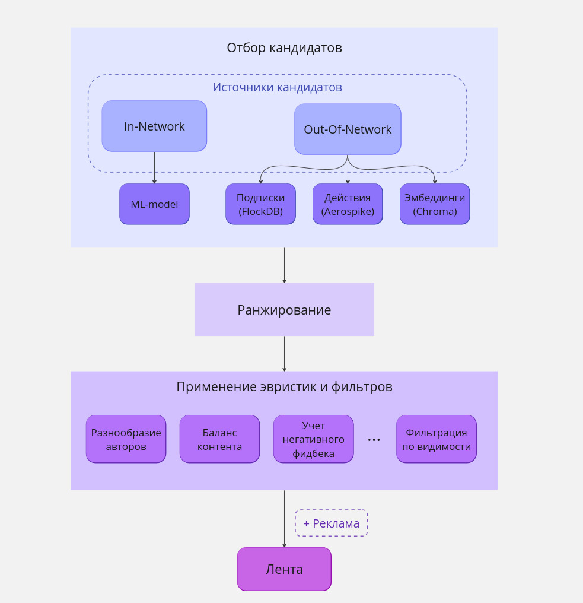
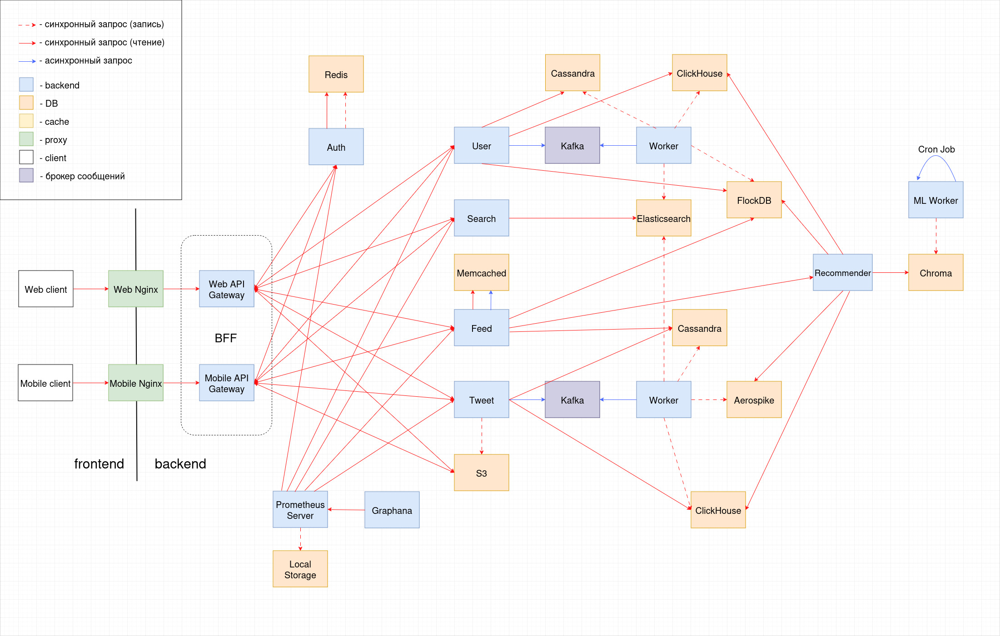

# Highload Twitter

## 1. Тема и целевая аудитория
Твиттер - сервис микроблогов и социальная сеть, в которой пользователи публикуют сообщения, известные как твиты.

### Целевая аудитория

Целевая аудитория Твиттера включает миллионы пользователей по всему миру.  

Топ-10 стран по месячной аудитории (MAU)  
_Данные основаны на показателях рекламных охватов Твиттера, опубликованных в апреле 2023 года._ [[1]](https://datareportal.com/essential-twitter-stats)

| Страна            | Пользователи |
|:------------------|:-------------|
| США               | 64.9 млн     |
| Япония            | 51.8 млн     |
| Бразилия          | 16.6 млн     |
| Великобритания    | 16.1 млн     |
| Индия             | 15.0 млн     |
| Индонезия         | 14.8 млн     |
| Турция            | 13.8 млн     |
| Мексика           | 11.8 млн     |
| Саудовская Аравия | 11.4 млн     |
| Франция           | 9.5 млн      |

### Ключевой функционал
- Регистрация и авторизация
- Публикация твитов
  - Твит может содержать текст до 280 символов (включая хештеги), фото и видео
  - Твит может быть либо отдельным твитом, либо ответом на другой твит
- Возможность лайкать и репостить твиты
- Поиск:
  - пользователей по юзернейму
  - твитов по хештегам
- Подписка на других пользователей
- Получение ленты
  - Лента формируется на основе подписок, активности пользователя, а также рекламы
  - Лента пополняется новыми твитами в реальном времени

## 2. Расчет нагрузки

### Продуктовые метрики

Все найденные метрики, которые будут использоваться в расчетах:
- Количество зарегистрированных пользователей: 1.3 млрд [[2]](https://www.demandsage.com/twitter-statistics/)
- Месячная аудитория (MAU): 528.3 млн [[2]](https://www.demandsage.com/twitter-statistics/)
- Дневная аудитория (DAU): 237.8 млн [[2]](https://www.demandsage.com/twitter-statistics/)
- Среднее время на сайте: 30.9 минут в день [[2]](https://www.demandsage.com/twitter-statistics/)
- 100 самых популярных аккаунтов имеют более 24 миллионов подписчиков [[3]](https://notcommon.com/most-followed/twitter)
- Количество твитов в день: 500 млн [[4]](https://blog.twitter.com/engineering/en_us/a/2013/new-tweets-per-second-record-and-how)

**_Основные метрики_**

| Метрика | Значение  |
|:--------|:----------|
| MAU     | 528.3 млн |
| DAU     | 237.8 млн |

**_Действия пользователя_**

1. Будем считать, что пользователю необходимо проходить авторизацию один раз в 10 дней.
2. Каждый пользователь в среднем получает ленту 5 раз в день. 
3. Пользователь проводит в Твиттере около 30 минут в день.
Будем считать, что за минуту он просматривает 10 твитов. Получаем 300 просмотров в день. 
4. Допустим, что пользователь лайкает пятую часть просмотренных твитов. 
5. Дневная аудитория составляет 237.8 млн пользователей, которые публикуют 500 млн твитов.
Получается, что один пользователь в среднем публикует 2 твита в день. 
6. Предположим, что пользователь подписывается на кого-то в среднем один раз в день.
7. Поиск используется относительно редко, большую часть времени пользователи просматривают твиты из своей ленты.
Поэтому будем считать, что этот функционал используется примерно 3 раза в неделю.

|   | Действие           | Кол-во в день |
|---|:-------------------|:--------------|
| 1 | Авторизация        | 0.1           |
| 2 | Получение ленты    | 5             |
| 3 | Просмотр твита     | 300           |
| 4 | Лайк твита         | 60            |
| 5 | Публикация твита   | 2             |
| 6 | Подписка           | 1             |
| 7 | Поиск по юзернейму | 0.4           |
| 8 | Поиск по хештегу   | 0.4           |

**_Размер хранилища_**

Твит может содержать текст, изображения и видео. Примерный размер этих данных:
1. Текст = ~200 байт [[5]](https://www.slideshare.net/raffikrikorian/twitter-by-the-numbers)
2. Изображение = ~1.2 Мб [[6]](https://gitnux.org/average-photo-size/)
3. Видео = ~40 Мб  
(такой размер имеет 20-секундное видео, снятое на айфон с разрешением 1080p HD и 30 fps
[[7]](https://www.lifewire.com/how-much-video-can-iphone-record-2000304))

Преобладающее большинство твитов содержат одну картинку или одно видео.
Однако твиты, публикующиеся в качестве комментариев, чаще всего не имеют вложений.
Будем считать, что:
- 100% твитов содержат текст
- 40% твитов помимо текста содержат одну картинку
- 3% твитов помимо текста содержат одно видео

С учетом того, что пользователь публикует 2 твита в день,
рассчитаем количество данных для одного пользователя и для всех пользователей за год.

_Для одного пользователя:_
```
1. Текст: 2 * 365 = 730
2. Изображения: 730 * 0.4 = 292
3. Видео: 730 * 0.03 = 22
```

_Для всех пользователей:_
```
1. Текст: 730 * 237.8 млн = ~174 млрд
2. Изображения: 292 * 237.8 млн = ~69 млрд
3. Видео: 22 * 237.8 млн = ~5 млрд
```

_**Размер хранилища пользователя**_

| Тип данных  | Размер 1 шт | Кол-во за год | Размер за год | Кол-во за 5 лет | Размер за 5 лет |
|:------------|-------------|:--------------|:--------------|:----------------|-----------------|
| Текст       | 0.0002 Мб   | 730           | 0.146 Мб      | 3650            | 0.0007 Гб       |
| Изображение | 1.2 Мб      | 292           | 350 Мб        | 1460            | 1.75 Гб         |
| Видео       | 40 Мб       | 22            | 880 Мб        | 110             | 4.4 Гб          |
| `Всего`     |             |               | `~1.2 Гб`     |                 | `~6 Гб`         |

_**Размер хранилища всех пользователей**_

| Тип данных  | Размер 1 шт | Кол-во за год | Размер за год | Кол-во за 5 лет | Размер за 5 лет |
|:------------|-------------|:--------------|:--------------|:----------------|-----------------|
| Текст       | 0.0002 Мб   | 174 млрд      | 0.035 Пб      | 870 млрд        | 0.17 Пб         |
| Изображение | 1.2 Мб      | 69 млрд       | 83 Пб         | 345 млрд        | 415 Пб          |
| Видео       | 40 Мб       | 5 млрд        | 200 Пб        | 25 млрд         | 1000 Пб         |
| `Всего`     |             |               | `~283 Пб`     |                 | `~1415 Пб`      |

### Технические метрики

_**RPS по основным типам запросов**_

_Регистрация_

Твиттер стал доступен для пользователей в середине 2006 года.
На начало 2024 года количество зарегистрированных пользователей составляет 1.3 млрд.

```
1.3 млрд регистраций / 17.5 лет = ~74 млн регистраций/год
RPS = (74 млн регистраций/год) / (365 * 24 * 60 * 60) = ~2.3
```

_Авторизация_
```
237.8 млн польз. * 0.1 авторизаций/день = 23.78 млн авторизаций/день
RPS = (23.78 млн авторизаций/день) / (24 * 60 * 60) = ~275
```

_Получение ленты_
```
237.8 млн польз. * 5 получений ленты/день = 1.19 млрд получений ленты/день
RPS = (1.19 млрд получений ленты/день) / (24 * 60 * 60) = ~13 770
```

_Просмотр твита_  
```
237.8 млн польз. * 300 просмотров/день = 71.34 млрд просмотров/день
RPS = (71.34 млрд просмотров/день) / (24 * 60 * 60) = ~825 700
```

_Лайк твита_
```
237.8 млн польз. * 60 лайков/день = 14.3 млрд лайков/день
RPS = (14.3 млрд лайков/день) / (24 * 60 * 60) = ~165 140
```

_Публикация твита_
```
RPS = (500 млн твитов/день) / (24 * 60 * 60) = ~5790
```

_Подписка_
```
237.8 млн польз. * 1 подписка/день = 237.8 млн подписок/день
RPS = (237.8 млн подписок/день) / (24 * 60 * 60) = ~2750
```

_Поиск по юзернейму_
```
237.8 млн польз. * 0.4 поисков/день = 95 млн поисков/день
RPS = (95 млн поисков/день) / (24 * 60 * 60) = ~1100
```

_Поиск по хештегу_
```
237.8 млн польз. * 0.4 поисков/день = 95 млн поисков/день
RPS = (95 млн поисков/день) / (24 * 60 * 60) = ~1100
```

Самый загруженный час в Твиттере - с 12:00 до 13:00 (США), за это время отправляется 5.44 % всех твитов. [[8]](https://smallbusiness.chron.com/peak-times-twitter-activity-62864.html)  
Будем считать, что пиковая нагрузка в 1.3 раза выше средней.

| Действие           | RPS     | Пиковое значение RPS |
|:-------------------|:--------|----------------------|
| Регистрация        | 2.3     | 3                    |
| Авторизация        | 275     | 358                  |
| Получение ленты    | 13 770  | 17 900               |
| Просмотр твита     | 825 700 | 1 073 400            |
| Лайк твита         | 165 140 | 214 700              |
| Публикация твита   | 5790    | 7527                 |
| Подписка           | 2750    | 3575                 |
| Поиск по юзернейму | 1100    | 1430                 |
| Поиск по хештегу   | 1100    | 1430                 |

_**Сетевой трафик**_

Допустим, средний размер твита 0.5 Мб.  
Рассчитаем пиковое потребление сетевого трафика в течение суток.
```
Просмотр: 1 073 400 твитов/c * 0.5 Мб = 536.7 Гб/c
Публикация: 7527 твитов/c * 0.5 Мб = 3.8 Гб/c
```


## 3. Глобальная балансировка нагрузки

### Расположение датацентров

На карте показано распределение MAU Твиттера по странам и расположение датацентров. [[9]](https://worldpopulationreview.com/country-rankings/twitter-users-by-country)


Расположение датацентров выбрано на основе того, в каких странах и регионах находится наибольшее количество пользователей.

| Датацентр        | Регионы                                   |
|:-----------------|:------------------------------------------|
| США, Портленд    | Западные штаты США и Канада               |
| США, Атланта     | Восточные штаты США, Южная Америка        |
| Япония           | Восточная и Юго-Восточная Азия, Австралия |
| Великобритания   | Европа, Африка                            |
| Индия            | Южная, Юго-Западная и Центральная Азия    |

### Глобальная балансировка

Для глобальной балансировки будет использоваться latency-based DNS.  
Это позволит отправлять запросы пользователя в ближайшие датацентры, которые отвечают с минимальной задержкой.

## 4. Локальная балансировка нагрузки

### Схема балансировки


С помощью Latency-based DNS пользователь получает адрес нужного датацентра.  

На входе в датацентр стоит маршрутизатор, который равномерно распределяет трафик между
несколькими Nginx балансировщиками по алгоритму хэширования. Если один из балансировщиков упадет,
то весь трафик перераспределится на другие.  
Nginx осуществляет балансировку на ноды Kubernetes.  
Kubernetes выполняет auto-scaling, перезапускает сервисы при падении. Это обеспечивает отказоустойчивость.

## 5. Логическая схема БД


### Размер данных

- int = 4 байта
- bigint = 8 байт
- uuid = 16 байт
- date = 4 байта
- timestamp = 8 байт
- boolean = 1 байт
- varchar(n) = n байт
- текст твита = ~200 байт
- название медиафайла = ~16 байт
- url медиафайла = ~64 байта

Во втором разделе было определено, что за год пользователи публикуют
~174 млрд твитов, ~69 млрд изображений и ~5 млрд видео.  
В таблице представлено примерное количество записей, созданных за 17.5 лет, и примерный размер.


| Таблица          | Размер одной записи | Кол-во записей | Размер всех записей |
|:-----------------|---------------------|----------------|---------------------|
| User             | ~430 байт           | 1.3 млрд       | 560 Гб              |
| User_aggregated  | ~16 байт            | 1.3 млрд       | 21 Гб               |
| User_session     | ~32 байта           | 237.8 млн      | 8 Гб                |
| Tweet            | ~250 байт           | 3000 млрд      | 750 Тб              |
| Tweet_aggregated | ~24 байта           | 3000 млрд      | 72 Тб               |
| Photo_metadata   | ~100 байт           | 1200 млрд      | 120 Тб              |
| Video_metadata   | ~120 байт           | 90 млрд        | 11 Тб               |

## 6. Физическая схема БД

### Выбор СУБД

|    | Таблица            | СУБД          |
|:---|:-------------------|---------------|
| 1  | User               | Cassandra     |
| 2  | User_name_index    | Elasticsearch |
| 3  | User_aggregated    | ClickHouse    |
| 4  | User_session       | Redis         |
| 5  | Followings         | FlockDB       |
| 6  | User_actions       | Aerospike     |
| 7  | Embeddings         | Chroma        |
| 8  | Tweet              | Cassandra     |
| 9  | Tweet_aggregated   | ClickHouse    |
| 10 | Hashtag            | Cassandra     |
| 11 | Hashtag_name_index | Elasticsearch |
| 12 | Photo_metadata     | Cassandra     |
| 13 | Video_metadata     | Cassandra     |
| 14 | Photo              | S3            |
| 15 | Video              | S3            |


### Шардирование и репликация

Ниже перечислены таблицы, которые будут шардироваться. Для всех шардов будет настроена репликация.  
В качестве коэффициента репликации (Replication Factor, RF) выбраны значения,
рекомендуемые в документации используемых СУБД.   

|   | Таблица          | Поле       | СУБД       | RF | Тип репликации | 
|---|:-----------------|------------|------------|----|----------------|
| 1 | User             | id         | Cassandra  | 3  | Masterless     |
| 2 | User_aggregated  | id         | ClickHouse | 3  | Multi-Master   |
| 3 | User_session     | session_id | Redis      | 2  | Master - Slave |
| 4 | User_actions     | user_id    | Aerospike  | 2  | Master - Slave |
| 5 | Tweet            | tweet_id   | Cassandra  | 3  | Masterless     |
| 6 | Tweet_aggregated | id         | ClickHouse | 3  | Multi-Master   |
| 7 | Photo_metadata   | id         | Cassandra  | 3  | Masterless     |
| 8 | Video_metadata   | id         | Cassandra  | 3  | Masterless     |

### Индексы

| Таблица            | Поле | Индекс                                              |
|:-------------------|------|-----------------------------------------------------|
| User_name_index    | name | Инвертированный индекс с префиксами в Elasticsearch |
| Hashtag_name_index | name | Инвертированный индекс с префиксами в Elasticsearch |

## 7. Алгоритмы

### Поиск

Для поиска по юзернеймам и хэштегам будет использоваться Elasticsearch.  
Каждый раз, когда пользователь вводит символ в поисковую строку,
необходимо отправлять ему несколько имеющихся имен или хэштегов,
которые начинаются с заданного префикса.

Для быстрого поиска по префиксам каждое слово в текстовом поле разбивается на набор префиксов,
которые затем сохраняются в инвертированном индексе.


### Алгоритм рекомендаций

Рассмотрим, как работает алгоритм для выполнения одного запроса на получение ленты.
Алгоритм состоит из трех этапов.
[[11]](https://blog.twitter.com/engineering/en_us/topics/open-source/2023/twitter-recommendation-algorithm)

**1. Отбор кандидатов**

Есть два типа кандидатов:
- In‑Network - твиты от тех, на кого пользователь подписан
- Out‑of‑Network - твиты от тех, на кого пользователь не подписан

Твиты In-Network ранжируются с помощью ML-модели, которая предсказывает вероятность взаимодействия между двумя пользователями.

Твиты Out‑of‑Network выбираются на основе следующих вопросов:

```Какие твиты недавно лайкнули люди, на которых я подписан?```  
```Кто лайкает те же твиты, что и я? Что еще они недавно лайкнули?```  
```Какие твиты и пользователи похожи на мои интересы?```  

Для отбора таких твитов анализируется граф подписок в FlockDB, действия пользователей в Aerospike,
а также эмбеддинги в Chroma.  
Эмбеддинг - это векторное представление интересов пользователя. Эмбеддинги создаются специальной ML-моделью.

В результате из миллионов твитов выбирается ~1500 самых актуальных.

**2. Ранжирование**

На этом этапе нейронная сеть определяет, насколько каждый твит соответствует ленте пользователя,
и ставит соответствующую оценку.

**3. Применение эвристик и фильтров**

Твиты выбираются по следующим принципам:

- Разнообразие авторов - фильтрация длинных последовательностей твитов одного автора
- Баланс контента - обеспечение баланса In-Network и Out-of-Network твитов,
их должно быть примерно поровну
- Учет негативного фидбека - фильтрация твитов, похожих на те,
где пользователь дал отрицательную обратную связь
- Фильтрация по видимости - фильтрация твитов с неприличным содержанием



## 8. Технологии

| Технология    | Область применения                                                   | Преимущества технологии                                                                                                                            |
|:--------------|----------------------------------------------------------------------|----------------------------------------------------------------------------------------------------------------------------------------------------|
| Typescript    | Frontend                                                             | Статическая типизация, полная поддержка ООП, большое сообщество                                                                                    |
| React         | Frontend                                                             | Компонентный подход, виртуальный DOM, популярность                                                                                                 |
| Go            | Основной язык для backend-сервисов                                   | Простота и минимализм, высокая производительность                                                                                                  |
| С, C++        | Задачи, требующие оптимальной производительности                     | Высокая производительность                                                                                                                         |
| Python        | Анализ данных, машинное обучение                                     | Простота, большое количество библиотек                                                                                                             |
| gRPC          | Взаимодействие backend-сервисов                                      | Эффективная сериализация данных в формате protobuf, поддержка множества языков программирования                                                    |
| Kafka         | Потоковая обработка событий                                          | Высокая пропускная способность и низкая задержка, масштабируемость, большое сообщество                                                             |
| Aerospike     | Хранение действий пользователей                                      | SSD optimized, крайне высокая пропускная способность и низкая задержка                                                                             |
| Cassandra     | Хранение пользователей, твитов, хэштегов и метаданных медиафайлов    | Автоматическое масштабирование; гибкая схема данных, основанная на column-families                                                                 |
| ClickHouse    | Хранение и аналитика агрегированных данных по твитам и пользователям | Высокая производительность при выполнении аналитических запросов над большими объемами данных                                                      |
| Elasticsearch | Индексы для поиска пользователей по имени и твитов по хэштегам       | Высокая производительность поиска                                                                                                                  |
| FlockDB       | Хранение данных о подписках в виде списков смежности                 | Оптимизация для работы с очень большими списками смежности; высокая скорость операций добавления, обновления и удаления                            |
| Chroma        | Хранение и анализ эмбеддингов                                        | Создана специально для работы с эмбеддингами                                                                                                       |
| Redis         | Хранение пользовательских сессий                                     | In-memory, персистентность, репликация                                                                                                             |
| Amazon S3     | Хранение медиафайлов                                                 | Надежность, масштабируемость, высокая доступность, низкая стоимость                                                                                |
| Memcached     | Кэширование                                                          | In-memory, простота, популярность                                                                                                                  |
| Nginx         | Балансировщик нагрузки                                               | Эффективная обработка большого количества одновременных соединений, возможность расширения функционала с помощью добавления дополнительных модулей |
| Envoy         | Circuit breaking                                                     | Гибкая настройка, большое сообщество                                                                                                               |
| Kubernetes    | Управление контейнерами                                              | Автоматическое масштабирование, service discovery, перезапуск сервисов при падении                                                                 |
| Prometheus    | Сбор и хранение метрик                                               | Возможность создания гибких запросов к данным                                                                                                      |
| Grafana       | Визуализация метрик для мониторинга сервисов                         | Гибкая настройка графиков                                                                                                                          |
| Cron          | Запуск ML-пайплайна                                                  | Гибкость и простота                                                                                                                                |

## 9. Схема проекта



### Паттерны

- Backend For Frontend
- CQRS

### API

#### Auth service

- GET /auth

#### User service

- POST /login
- POST /logout
- POST /sign_up
- POST /follow/{user_id}
- GET /followers/{user_id}
- GET /followings/{user_id}
- GET /user/{user_id}

#### Tweet service

- GET /tweet/{tweet_id}
- POST /tweet
- POST /retweet/{tweet_id}
- POST /reply/{tweet_id}
- POST /view/{tweet_id}
- POST /like/{tweet_id}

#### Search service

- GET /search/{query}

#### Feed service

- GET /feed


## 10. Обеспечение надежности

### Резервирование

- Резервирование CPU, RAM и дисков
- Резервирование серверов
- Резервирование датацентров
- Репликация баз данных

### Failover policy

- Уменьшение количества запросов, посылаемых на проблемный хост 
- Envoy в качестве Circuit Breaker  
Контролирует доступ к микросервисам, отслеживает количество ошибок от этих микросервисов и лимитирует трафик.
Когда количество ошибок от микросервиса превышает заданный порог, Circuit Breaker снижает количество запросов к нему
- Повторение запросов
- Использование упрощенной логики при отказе основной

### Graceful shutdown

Плавная остановка сервиса.
Сервис перестает принимать новые запросы, завершает обработку полученных запросов и
закрывает все открытые соединения с другими сервисами и базами данных.

### Graceful degradation

Основные функции приложения должны работать даже при выходе из строя значительной части системы.

#### Упрощение логики составления ленты
Ключевым функционалом Твиттера является составление ленты с помощью [алгоритма рекомендаций](#алгоритм-рекомендаций).

Запрос на составление ленты обрабатывает сервис Feed.
Для этого он идет в сервис Recommender, который в свою очередь взаимодействует со следующими СУБД:
- FlockDB - получает информацию о подписках
- Aerospike - получает информацию о действиях пользователей
- ClickHouse - отбирает популярные твиты и популярных пользователей по хранящимся там счетчикам
- Chroma - анализирует эмбеддинги

К полученным данным Recommender применяет специальные модели и отдает сервису Feed отобранные твиты.

Однако если компоненты Recommender, Aerospike, ClickHouse или Chroma недоступны,
нужно отдать пользователю хотя бы твиты In-Network - твиты от тех, на кого он подписан.  
Для выполнения этой упрощенной логики Feed будет самостоятельно идти в FlockDB, чтобы получить информацию о подписках пользователя,
а затем доставать из Cassandra последние твиты этих людей.

#### Отсутствие счетчиков

Если ClickHouse будет недоступен, то можно отправлять пользователю твиты 
без количества просмотров, лайков, реплаев и репостов, а также
информацию о других пользователях без количества их подписчиков и подписок.

### Асинхронные паттерны

#### CQRS  
Паттерн заключается в разделении пайплайнов для чтения и записи в БД. 
Запись в БД происходит асинхронно - микросервис кладет данные в виде сообщений в Kafka,
а затем специальный воркер достает эти сообщения и записывает данные в БД.

На схеме проекта отражено такое взаимодействие между следующими компонентами:
- User - Cassandra
- User - ClickHouse
- User - FlockDB
- Tweet - Cassandra
- Tweet - ClickHouse

### Observability

- Логирование с request id
- Мониторинг
- Профилирование сервисов с помощью golang pprof

## Источники
1. https://datareportal.com/essential-twitter-stats
2. https://www.demandsage.com/twitter-statistics/
3. https://notcommon.com/most-followed/twitter
4. https://blog.twitter.com/engineering/en_us/a/2013/new-tweets-per-second-record-and-how
5. https://www.slideshare.net/raffikrikorian/twitter-by-the-numbers
6. https://gitnux.org/average-photo-size/
7. https://www.lifewire.com/how-much-video-can-iphone-record-2000304
8. https://smallbusiness.chron.com/peak-times-twitter-activity-62864.html
9. https://worldpopulationreview.com/country-rankings/twitter-users-by-country
10. https://github.com/twitter/the-algorithm
11. https://blog.twitter.com/engineering/en_us/topics/open-source/2023/twitter-recommendation-algorithm
